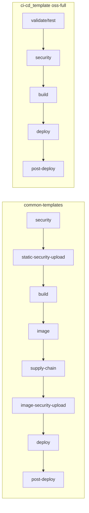

# Инсайты из common-templates для ci-cd_template

## Контекст

[`common-templates-adaptation-log.md`](.external/common-templates%20(Copy)/common-templates-adaptation-log.md) описывает адаптацию **библиотеки GitLab include** (`seps/ci-cd/common-templates`) под модель `ci-cd_template` с жёстким ограничением: **не ломать deploy** (Kaniko + Helm). Это другой потребитель, чем FSTEC (GitHub adopt в репозиторий), но пересекается по security-контролям B1–D1.



## Уже покрыто (не дублировать)

| Инсайт common-templates | Статус в ci-cd_template |
|---------------------------|-------------------------|
| forbidden-files B6 | [`forbidden-files.yml`](templates/gitlab/jobs/forbidden-files.yml) + FSTEC flat gates |
| Trivy FS в shift-left (security) | `trivy-osa` в stage `security` |
| DAST после deploy | `post-deploy` + `needs: deploy-preprod optional` в [`dast.yml`](templates/gitlab/jobs/dast.yml) |
| DefectDojo metadata | [`aspm-export.yaml`](config/aspm-export.yaml): `commit_hash`, `branch_tag`, `build_id`, `DEFECTDOJO_ENGAGEMENT` |
| SBOM + image SCA | `sbom.yml` + `trivy-sca.yml` |
| Day-1 warn policy | [`security-gate-policy-adopt.yaml`](config/security-gate-policy-adopt.yaml) (FSTEC) |
| Compose-local DAST | [`dast-compose-oss.yml`](templates/github/workflows/dast-compose-oss.yml) (FSTEC) |

## Инсайты, которые стоит включить

### 1. Стадийная модель v2 (высокий приоритет — docs + GitLab profile)

**Проблема из common-templates:** stage `test` содержал только security-сканы; `image-scan` смешивал SBOM и SCA; DAST мог оказаться до deploy.

**Рекомендация для ci-cd_template:**

- Зафиксировать в [`docs/02-pipeline-architecture.md`](docs/02-pipeline-architecture.md) и [`docs/platforms/gitlab-oss-full.md`](docs/platforms/gitlab-oss-full.md) каноническую enterprise-модель:
  - `security` — только static (B1–B6)
  - `supply-chain` — SBOM + image SCA (C1–C2), **после** build image
  - `post-deploy` — DAST/IAST/sec-func **после** deploy
- Опционально: переименовать stage `build` → split `build` + `image` в **новом** profile `oss-full-enterprise.gitlab-ci.yml` (не ломая текущий `oss-full`).

**Почему:** потребители common-templates уже мигрировали stage names; adopt из ci-cd_template должен давать совместимую терминологию.

### 2. ASPM upload waves (средний приоритет — GitLab jobs)

**Паттерн common-templates** ([`roles/defectdojo.upload.yaml`](.external/common-templates%20(Copy)/roles/defectdojo.upload.yaml)):

- Отдельные stages `static-security-upload` и `image-security-upload`
- Каждый upload: `needs: optional: true`, skip если файл отсутствует/пустой
- Upload **никогда** не блокирует deploy (`allow_failure: true`, `exit 0` на HTTP 4xx)

**Текущее состояние:** inline [`.aspm_export`](templates/gitlab/jobs/aspm/export-after-script.yml) в каждом scan-job.

**Рекомендация:**

- Добавить [`templates/gitlab/jobs/aspm/upload-static.yml`](templates/gitlab/jobs/aspm/upload-static.yml) и `upload-image.yml` с `needs: optional: true` на scan jobs
- В `after_script` scan-jobs оставить export **или** убрать в пользу upload-wave (выбрать одно — upload-wave ближе к common-templates)
- В [`scripts/aspm-export.py`](scripts/aspm-export.py) по умолчанию вызывать с `--skip-empty` из upload jobs (флаг уже есть, но не используется в template)

### 3. Deploy-safe security (высокий приоритет — deploy logic)

**Принцип #1 из common-templates:** security не меняет needs/rules deploy jobs.

**Проверить/усилить в ci-cd_template:**

- [`helm-deploy.yml`](templates/gitlab/jobs/oss/helm-deploy.yml): `needs: trivy-sca optional: true` — ок, но при `gate-check` block на SCA deploy может косвенно стопориться через stage order. Документировать режимы:
  - **warn-only enterprise** (как common-templates): все security `allow_failure: true`, policy adopt
  - **gate mode** (shift-left/oss-full strict): block через `gate-check.py`
- Добавить переменную **`SECURITY_DISABLED`** / **`SAST_DISABLED`** в shared snippet [`templates/gitlab/jobs/_security.common.yml`](templates/gitlab/jobs/_security.common.yml) (аналог [`_security.common.yaml`](.external/common-templates%20(Copy)/roles/_security.common.yaml)) — `when: never` на все scan + ASPM jobs

### 4. Opt-in DAST и DefectDojo (средний приоритет)

**common-templates:**

```yaml
# DAST — только если задан URL
rules:
  - if: '$DAST_WEBSITE == null || $DAST_WEBSITE == ""'
    when: never
```

**ci-cd_template сейчас:** DAST только `when: manual`.

**Рекомендация:**

- В [`dast.yml`](templates/gitlab/jobs/dast.yml) и [`dast-compose.yml`](templates/gitlab/jobs/dast-compose.yml) добавить rules: auto-run на main **если** `PREPROD_URL` / `DAST_WEBSITE` задан (иначе skip, не manual stub)
- Унифицировать имя: `PREPROD_URL` (template) = `DAST_WEBSITE` (common-templates) — alias в docs [`docs/platforms/oss-full-shared.md`](docs/platforms/oss-full-shared.md)

**DefectDojo:** common-templates требует **и** URL **и** token для skip. В [`aspm-export.py`](scripts/aspm-export.py) при отсутствии token сейчас `return False` (но `DEFECTDOJO_FAIL_ON_ERROR=false` не валит job). Сделать symmetric skip: нет token → `exit 0` с сообщением (как в common-templates curl jobs).

### 5. Dual-format отчёты для DefectDojo (низкий приоритет)

**Инсайт:** Checkov и Hadolint в common-templates отдают **native JSON** для DefectDojo (`checkov-report.json`, `hadolint -f json`), не только SARIF/JUnit.

**Рекомендация:**

- В [`checkov-iac.yml`](templates/gitlab/jobs/oss/checkov-iac.yml): второй output `--output json` → `checkov-report.json` для ASPM
- В [`dockerfile-lint.yml`](templates/gitlab/jobs/dockerfile-lint.yml): `hadolint -f json` для Dojo + SARIF/normalize для gate/upload-sarif (GitHub)
- Расширить [`aspm-export.yaml`](config/aspm-export.yaml): `dockerfile.scan_type: "Hadolint Dockerfile check"`, `iac.scan_type: "Checkov Scan"` для JSON path

### 6. Multi-contour Helm deploy (низкий приоритет — enterprise deploy)

**common-templates** ([`VARS.md`](.external/common-templates%20(Copy)/VARS.md)): `HELM_NAMESPACE` suffix (`-int`, `-prod`) → auto `KUBE_INT_CONFIG`, `HELM_ENV_GIS_INT`.

**ci-cd_template:** фиксированные `preprod`/`prod` namespaces в [`helm-deploy.yml`](templates/gitlab/jobs/oss/helm-deploy.yml).

**Рекомендация:** не менять default oss-full; добавить supplement [`docs/references/supplements/gitlab-enterprise-deploy.md`](docs/references/supplements/gitlab-enterprise-deploy.md) с mapping common-templates vars → template vars, или optional `templates/gitlab/jobs/oss/helm-deploy-contour.yml`.

### 7. Case study supplement (docs)

По аналогии с [fstec-adaptation-case-study.md](docs/references/supplements/fstec-adaptation-case-study.md) — краткий [`common-templates-adaptation-case-study.md`](docs/references/supplements/common-templates-adaptation-case-study.md):

- Таблица «что перенесли / что отложили» (gate-check, cosign, conftest)
- Stage rename v2 migration guide
- Ссылка из [`adoption-checklist.md`](docs/adoption-checklist.md) § GitLab enterprise

### 8. Профиль-мост (опционально)

Для команд, которые **уже** на common-templates:

- Документ «bridge»: какие `roles/*.yaml` соответствуют `templates/gitlab/jobs/*`
- Будущий profile `shift-left-gitlab-library` — только security jobs + gate-check, без Helm (copy-paste includes)

## Что НЕ переносить в ci-cd_template

| Паттерн common-templates | Причина |
|--------------------------|---------|
| Warn-only без gate-check | У ci-cd_template core value — policy gates; enterprise режим через `security-gate-policy-adopt.yaml` |
| No push/MR triggers | ci-cd_template ориентирован на shift-left на каждый MR |
| GitLab Ultimate SAST templates | oss-full = 100% OSS docker scanners |
| Legacy `seps.template.yaml` frozen | вне scope reference repo |

## Предлагаемая очередь (после FSTEC)

| Wave | Scope | Files |
|------|-------|-------|
| CT-1 | Docs: stages v2, DAST opt-in, deploy-safe modes | `02-pipeline-architecture.md`, `gitlab-oss-full.md`, `oss-full-shared.md`, case study |
| CT-2 | `_security.common.yml` + `SAST_DISABLED` + DAST rules | new snippet + `dast.yml`, `dast-compose.yml`, all security jobs |
| CT-3 | ASPM upload waves (GitLab) | `aspm/upload-*.yml`, `aspm-export.py` token skip, `--skip-empty` |
| CT-4 | Dual-format Checkov/Hadolint for Dojo | `checkov-iac.yml`, `dockerfile-lint.yml`, `aspm-export.yaml` |
| CT-5 | Enterprise Helm contour (optional) | supplement + optional helm job variant |

## Verification

```bash
bash scripts/validate-yaml.sh
bash scripts/validate-gitlab-oss.sh
# После CT-2: security jobs skip при SAST_DISABLED=true
# После CT-3: pipeline green when scan skipped but upload stage present
```
