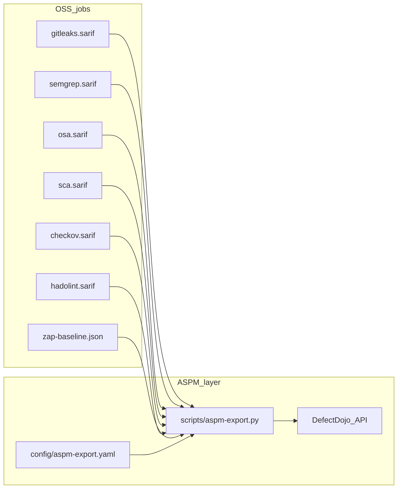

# DefectDojo ASPM Export для GitLab OSS

## Цель

- **Общий шаблон ASPM/ASOC** — конфиг + CLI, backend-agnostic (`noop`, `defectdojo`, задел под Jit/AppSec.Track).
- **GitLab OSS** — после каждого сканера upload в DefectDojo через `POST /api/v2/reimport-scan/` (dedup) или `import-scan/` (первый прогон).
- Источник API: [`.external/DefectDojo API v2.json`](.external/DefectDojo%20API%20v2.json) — endpoints `import-scan`, `reimport-scan`.



## 1. Конфиг ASPM (platform-agnostic)

**New:** [`config/aspm-export.yaml`](config/aspm-export.yaml)

```yaml
backend: defectdojo   # noop | defectdojo

defaults:
  enabled_env: DEFECTDOJO_URL
  allow_failure: true

defectdojo:
  reimport: true
  auto_create_context: true
  minimum_severity: Info
  close_old_findings: false
  product_name: "${DEFECTDOJO_PRODUCT_NAME:-${CI_PROJECT_NAME}}"
  engagement_name: "${DEFECTDOJO_ENGAGEMENT:-CI/CD}"
  commit_hash: "${CI_COMMIT_SHA}"
  branch_tag: "${CI_COMMIT_REF_NAME}"
  build_id: "${CI_PIPELINE_ID}"

controls:
  secrets:   { scan_type: "Gitleaks Scan", test_title: "secrets" }
  sast:      { scan_type: "SARIF", test_title: "sast-semgrep" }
  osa:       { scan_type: "SARIF", test_title: "osa-trivy-fs" }
  sca:       { scan_type: "SARIF", test_title: "sca-trivy-image" }
  iac:       { scan_type: "SARIF", test_title: "iac-checkov" }
  dockerfile:{ scan_type: "SARIF", test_title: "dockerfile-hadolint" }
  linters:   { scan_type: "SARIF", test_title: "linters" }
  dast:      { scan_type: "ZAP Scan", test_title: "dast-zap" }
```

Mapping rationale (из enum OpenAPI):
- SARIF-отчёты → generic **`SARIF`** + уникальный `test_title` per control.
- Gitleaks → **`Gitleaks Scan`** (native).
- ZAP baseline JSON → **`ZAP Scan`**.

## 2. CLI `scripts/aspm-export.py`

**New:** [`scripts/aspm-export.py`](scripts/aspm-export.py)

```bash
python3 scripts/aspm-export.py \
  --control secrets \
  --report gitleaks.sarif \
  --config config/aspm-export.yaml
```

Поведение:
- **`noop`** backend если `DEFECTDOJO_URL` не задан — exit 0, log skip.
- **`defectdojo`** backend:
  - `multipart/form-data` POST на `{url}/api/v2/reimport-scan/` если `reimport: true`, иначе `import-scan/`.
  - Auth: header `Authorization: Token ${DEFECTDOJO_API_TOKEN}`.
  - Поля из config + env: `product_name`, `engagement_name`, `test_title`, `scan_type`, `commit_hash`, `branch_tag`, `build_id`, `auto_create_context`, `minimum_severity`.
  - File upload: `-F file=@report`.
  - Skip если report missing/empty SARIF (0 findings ok — всё равно upload или skip по флагу `--skip-empty`).
- Exit 0 при `allow_failure`; exit 1 только если `DEFECTDOJO_FAIL_ON_ERROR=true`.

Без внешних deps — `urllib.request` + stdlib (как [`gate-check.py`](scripts/gate-check.py)).

## 3. GitLab snippet (per-scan upload)

**New:** [`templates/gitlab/jobs/aspm/export-after-script.yml`](templates/gitlab/jobs/aspm/export-after-script.yml)

```yaml
.aspm_export:
  after_script:
    - |
      [ -n "${ASPM_REPORT:-}" ] && [ -f "${ASPM_REPORT}" ] || exit 0
      python3 scripts/aspm-export.py \
        --control "${ASPM_CONTROL}" \
        --report "${ASPM_REPORT}" \
        --config "${ASPM_CONFIG:-config/aspm-export.yaml}" || \
        [ "${DEFECTDOJO_FAIL_ON_ERROR:-false}" != "true" ]
```

Каждый OSS job **extends** `.aspm_export` и задаёт variables:

| Job file | `ASPM_CONTROL` | `ASPM_REPORT` |
|----------|----------------|---------------|
| [`oss/gitleaks.yml`](templates/gitlab/jobs/oss/gitleaks.yml) | `secrets` | `gitleaks.sarif` |
| [`oss/semgrep-sast.yml`](templates/gitlab/jobs/oss/semgrep-sast.yml) | `sast` | `semgrep.sarif` |
| [`oss/trivy-osa.yml`](templates/gitlab/jobs/oss/trivy-osa.yml) | `osa` | `osa.sarif` |
| [`oss/trivy-sca.yml`](templates/gitlab/jobs/oss/trivy-sca.yml) | `sca` | `sca.sarif` |
| [`oss/checkov-iac.yml`](templates/gitlab/jobs/oss/checkov-iac.yml) | `iac` | `reports/checkov.sarif` |
| [`dockerfile-lint.yml`](templates/gitlab/jobs/dockerfile-lint.yml) | `dockerfile` | `hadolint.sarif` |
| [`linter-security.yml`](templates/gitlab/jobs/linter-security.yml) | `linters` | `linter.sarif` |
| [`dast.yml`](templates/gitlab/jobs/dast.yml) | `dast` | `reports/zap-baseline.json` |

Include snippet в [`oss-full.gitlab-ci.yml`](templates/profiles/oss-full.gitlab-ci.yml):

```yaml
include:
  - local: '/templates/gitlab/jobs/aspm/export-after-script.yml'
  ...
```

Gate-check остаётся в `script:`; ASPM upload — только `after_script:` (не блокирует gate, `allow_failure` по умолчанию).

## 4. Policy + adoption

**Update:** [`config/security-gate-policy.yaml`](config/security-gate-policy.yaml) — секция:

```yaml
aspm_export:
  mode: optional
  backend: defectdojo
  in_pipeline: true
  block_ci: false
```

**Update:** [`scripts/adopt.sh`](scripts/adopt.sh) — копировать `config/aspm-export.yaml` + `scripts/aspm-export.py` для всех profiles (как `gate-check.py`).

## 5. Документация

| File | Content |
|------|---------|
| **new** [`docs/references/defectdojo-api.md`](docs/references/defectdojo-api.md) | Ссылка на `.external/DefectDojo API v2.json`, `import-scan`/`reimport-scan`, scan_type mapping |
| **new** [`docs/runbooks/aspm-export.md`](docs/runbooks/aspm-export.md) | Setup: Product/Engagement, CI variables, первый import vs reimport |
| **update** [`docs/platforms/gitlab-oss-full.md`](docs/platforms/gitlab-oss-full.md) | § DefectDojo variables |
| **update** [`docs/03-security-controls.md`](docs/03-security-controls.md) | ASTO row: `implemented` для oss-full + `jobs/aspm/*` |
| **update** [`CHANGELOG.md`](CHANGELOG.md) | v1.4.1 entry |

### CI/CD variables (document)

| Variable | Required | Purpose |
|----------|----------|---------|
| `DEFECTDOJO_URL` | yes | Base URL, e.g. `https://defectdojo.example.com` |
| `DEFECTDOJO_API_TOKEN` | yes | API token (masked) |
| `DEFECTDOJO_PRODUCT_NAME` | no | Default `$CI_PROJECT_NAME` |
| `DEFECTDOJO_ENGAGEMENT` | no | Default `CI/CD` |
| `DEFECTDOJO_FAIL_ON_ERROR` | no | Default `false` |

## 6. Skills (minimal)

Update [`.agents/skills/devsecops-tooling/SKILL.md`](.agents/skills/devsecops-tooling/SKILL.md) — path `scripts/aspm-export.py`, config mapping.

## 7. Validation

```bash
# Local noop
python3 scripts/aspm-export.py --control sast --report /dev/null  # skip

# With mock (dry-run flag)
python3 scripts/aspm-export.py --control secrets --report examples/... --dry-run

# Policy
python3 scripts/validate-policy.py  # extend for aspm_export section
```

Live test against DefectDojo — manual (self-hosted URL).

## Порядок PR

1. **PR1:** `config/aspm-export.yaml` + `scripts/aspm-export.py` + `validate-policy.py`
2. **PR2:** `aspm/export-after-script.yml` + wire all oss-full jobs
3. **PR3:** docs + adopt.sh + CHANGELOG + skills

## Что не входит

- GitHub Actions workflow (можно позже — тот же CLI в step `if: env.DEFECTDOJO_URL`).
- DefectDojo deploy/helm (только client upload).
- Block CI on DefectDojo API failure (по умолчанию warn-only).
- Копирование 746KB OpenAPI в `docs/` — только ссылка на `.external/`.

## Acceptance

- [ ] Каждый OSS scanner job вызывает `aspm-export.py` в `after_script` при заданном `DEFECTDOJO_URL`
- [ ] Без URL — noop, pipeline не ломается
- [ ] `reimport-scan` с `auto_create_context` создаёт Product/Engagement/Test на первом прогоне
- [ ] Mapping control → scan_type документирован
- [ ] `adopt.sh --profile oss-full` копирует aspm config + script
