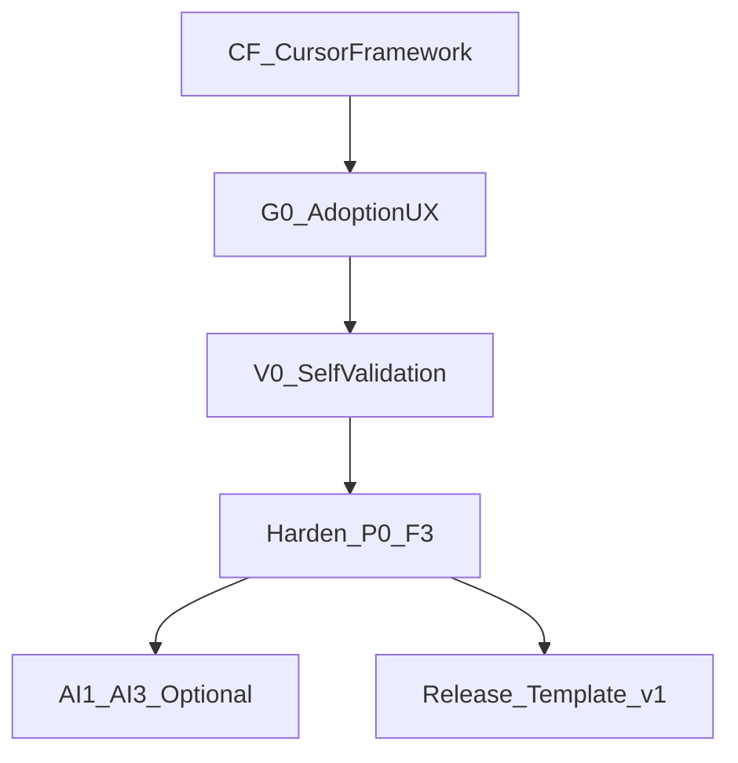

# План выполнения DevSecOps Master Plan (Cursor)

## Текущее состояние

**v1.3 (AI + MLSecOps):**
- Profile **`ai-ml`** — shift-left + AI1–AI2 + ML1–ML3 jobs (opt-in)
- `scripts/ai-ml-scan.py`, `examples/sample-ml-app/`
- Phase docs AI1–AI3, ML1–ML3; PII **block** on `ml_data`

**v1.2 (template hardening):** GitLab gates, Kyverno v2, adoption UX — см. CHANGELOG 1.2.0

**v1.1 (references migration):**
- `docs/references/` — DAF md, xlsx extracts, Secure SDLC, PDF archives, assets
- `.agents/skills/` (12) + `.cursor/skills/` stubs; `devsecops-reference-lookup`, `devsecops-secure-sdlc`
- Три SDLC-модели: DAF, финтех swimlane, Secure SDLC 8-stage

**Уже сделано (scaffold + v1.0 hardening):**
- Документация: [`docs/00-master-plan.md`](docs/00-master-plan.md) … [`docs/08-compliance-gost-56939.md`](docs/08-compliance-gost-56939.md), 23 файла [`docs/phases/`](docs/phases/), 4 [`docs/references/`](docs/references/)
- Шаблоны: GitLab ([`templates/gitlab/`](templates/gitlab/)), GitHub ([`templates/github/workflows/`](templates/github/workflows/)), K8s ([`templates/k8s/`](templates/k8s/)), [`config/security-gate-policy.yaml`](config/security-gate-policy.yaml)
- Skills: 10 skills в [`.cursor/skills/`](.cursor/skills/), точка входа `devsecops-template`
- Старый план [`.cursor/plans/devsecops_master_plan_f0db300c.plan.md`](.cursor/plans/devsecops_master_plan_f0db300c.plan.md) — **все todo = completed**, но описывает «пустой repo» и не отражает hardening

**Пробелы (почему это ещё не «готовый шаблон»):**

| Область | Проблема |
|---------|----------|
| CI gates | GitHub jobs с `continue-on-error: true` (secrets, dockerfile, sec-tests) — policy не enforced |
| Base pipeline | Placeholder lint/test/build в [`_base.yml`](templates/gitlab/jobs/_base.yml), [`ci.yml`](templates/github/workflows/ci.yml) |
| Progressive adopt | GitLab entrypoint включает **все** jobs сразу — нет профилей «только B1» / «до C2» |
| Adoption UX | [`templates/README.md`](templates/README.md) — 28 строк, нет скрипта миграции чужого pipeline |
| Linter gate | В финтех-PDF и docs есть, **job отсутствует** |
| Gate script | `security-gate-policy.yaml` декларативный, нет helper для exit code из SARIF |
| Cursor fixation | Нет `AGENTS.md`, нет [`.cursor/rules/`](.cursor/rules/), нет **нового** execution-plan |
| Example app | Нет `examples/` для проверки SAST/SCA/IaC/Dockerfile |
| Self-CI | Сам template-repo не валидирует свои YAML/workflows |
| Cisco AI | [docs/references/cisco-ai-defense.md](docs/references/cisco-ai-defense.md) — синтезирован в v1.1 |

---

## Стратегия: не переписывать, а harden + adopt

Каждый шаг = **отдельный PR**, **≤5 файлов**, правило из skill [`devsecops-phase-impl`](.cursor/skills/devsecops-phase-impl/SKILL.md).

Старый plan **не редактируем** — создаём новый [`.cursor/plans/devsecops-execution.plan.md`](.cursor/plans/devsecops-execution.plan.md) с актуальными todo.

---

## Волна CF — фиксация в Cursor (3 PR)

### CF-1: Execution plan + AGENTS.md
- Создать `.cursor/plans/devsecops-execution.plan.md` с frontmatter `todos` (все шаги ниже)
- Создать [`AGENTS.md`](AGENTS.md): ссылка на plan, skills, правило ≤5 files, порядок P0→F3
- Обновить [`README.md`](README.md): «как работать с Cursor plan» (1 абзац + ссылка)

### CF-2: Cursor rules
- `.cursor/rules/phase-impl.mdc` — alwaysApply: минимальный diff, зеркало GitLab/GitHub, warn→block
- `.cursor/rules/templates-ci.mdc` — globs: `templates/**/*.{yml,yaml}` — conventions SARIF, stages, include paths

### CF-3: Синхронизация skills ↔ plan
- Обновить [`devsecops-template/SKILL.md`](.cursor/skills/devsecops-template/SKILL.md): ссылка на execution plan, adoption profiles
- Обновить [`devsecops-phase-impl/reference.md`](.cursor/skills/devsecops-phase-impl/reference.md): CF-волна, progressive profiles

---

## Волна G0 — Adoption UX (5 PR, быстрое внедрение в чужой repo)

Цель: адаптировать чужой pipeline за минуты, подключая фазы по одной.

### G0-1: Progressive CI profiles
- `templates/profiles/minimal.gitlab-ci.yml` — только A2 (validate/test/build)
- `templates/profiles/shift-left.gitlab-ci.yml` — A2 + B1–B5
- `templates/profiles/supply-chain.gitlab-ci.yml` — + C1–C4
- `templates/profiles/full.gitlab-ci.yml` — текущий full include
- Зеркальные `templates/profiles/*.github.yml` (workflow_call bundles)

### G0-2: adopt.sh
- `scripts/adopt.sh --phase B3 --platform gitlab|github --target /path/to/repo`
- Копирует job-файлы, policy fragment, печатает diff checklist

### G0-3: examples/sample-app
- Минимальный `examples/sample-app/`: Dockerfile, `requirements.txt` с known CVE dep, `infra/main.tf`, `k8s/deployment.yaml`
- README: как прогнать B–E фазы локально

### G0-4: Расширить templates/README
- Таблица profiles, adopt.sh usage, «миграция с существующего .gitlab-ci.yml за 30 мин»
- Матрица: что копировать на каждой фазе

### G0-5: Чеклист адаптации
- `docs/adoption-checklist.md` — пошаговый для SecChamp/DevOps (внешний pipeline → full template)

---

## Волна V0 — Self-validation template repo (2 PR)

### V0-1: Meta-CI для этого репозитория
- `.github/workflows/validate-template.yml` — yamllint/actionlint на `templates/`
- `scripts/validate-yaml.sh` — локальная проверка

### V0-2: Gate policy schema check
- `scripts/validate-policy.py` — парсит `security-gate-policy.yaml`, проверяет обязательные секции по фазам

---

## Волна H — Hardening P0–F3 (микро-PR по подфазам)

Документация **уже есть** — каждый PR только **доводит templates + policy + phase doc** (критерии `[x]`).

| ID | Файлы (типично) | Суть hardening |
|----|-----------------|----------------|
| **H-P0** | `docs/phases/P0-scaffold.md` | Отметить acceptance, ссылка на execution plan |
| **H-A1** | `docs/platforms/*.md` | Branch protection copy-paste blocks (settings JSON/gh api) |
| **H-A2** | `_base.yml`, `ci.yml` | Убрать echo-stubs → реальный super-linter/golangci **opt-in** через variable |
| **H-B1** | `secret-scan.yml` ×2, policy | Убрать blind `continue-on-error`; gate script reads `secrets.mode` |
| **H-B2** | `sast.yml` ×2 | SARIF upload + CodeQL permissions verify |
| **H-B3** | `sca.yml` ×2 | dependency-review + Trivy fs unified exit |
| **H-B4** | `iac-scan.yml` ×2 | paths из policy `iac.paths` |
| **H-B5** | `dockerfile-lint.yml` ×2 | hadolint action + policy `dockerfile.mode` |
| **H-B6** | NEW `linter-security.yml` ×2, policy `linters:` | Security linters MR gate (финтех gap) |
| **H-C1** | `sbom.yml` ×2 | CycloneDX artifact name contract `sbom.cdx.json` |
| **H-C2** | `container-scan.yml` ×2 | Trivy SARIF → gate script |
| **H-C3** | `image-pull-policy.md` | Kyverno deny external registries example |
| **H-C4** | `sign.yml` ×2 | cosign keyless doc + `when: manual` default |
| **H-D1** | `dast.yml`, `deploy-preprod.yml`, `ci.yml` | Wire DAST after deploy-preprod in GitHub chain |
| **H-D2** | `sec-func-tests.yml`, `tests/security/` | Реальный pytest marker `@security` без skip-by-default |
| **H-D3** | `release-gate-checklist.md` | GitHub environment protection example |
| **H-E1** | `kyverno-policies.yaml` | 3 policies: no-latest, no-privileged, require-labels |
| **H-E2** | `default-deny.yml` | Namespace template + allow-dns |
| **H-E3** | `falco-values.yaml` | 2 custom rules (shell in container, sensitive mount) |
| **H-E4** | `example-rules.yml` | Falco → SIEM field mapping comment |
| **H-F1** | `iast-preprod.yml` | Document-only default; job `when: manual` |
| **H-F2** | `F2-rasp-waf.md` | Runbook links WAF/RASP checklist (no CI) |
| **H-F3** | `sbom-monitor-runbook.md` | Dependency-Track webhook stub |

### H-CORE: Gate enforcement helper (1 PR, разблокирует B1–C2)
- `scripts/gate-check.py` — вход: SARIF/JSON + policy section → exit 0/1
- Подключить в GitHub jobs (1 строка) и GitLab `after_script`

### H-PRE: pre-commit template (1 PR)
- `templates/pre-commit/.pre-commit-config.yaml` — gitleaks, detect-private-key

---

## Волна AI — опционально после F3 (3 PR)

Синтез [`.external/CISCO_AI_DEFENCE.md`](.external/CISCO_AI_DEFENCE.md) + [`docs/10-mlsecops-appendix.md`](docs/10-mlsecops-appendix.md).

| ID | Deliverable |
|----|-------------|
| **AI-1** | `docs/11-ai-security-appendix.md` + `docs/references/cisco-ai-defense.md` |
| **AI-2** | Skill `devsecops-ai-security` + update `devsecops-external-sources/references/xlsx-sheets.md` |
| **AI-3** | `docs/phases/AI1-skill-scan.md` + optional job stub `skill-scanner` (manual, warn) |

Не блокирует release v1.0.

---

## Волна R — Release готового template (2 PR)

### R-1: Template v1.0
- `CHANGELOG.md` — что входит в v1.0
- [`docs/00-master-plan.md`](docs/00-master-plan.md) — секция «Template status: v1.0»
- Все `docs/phases/*.md` — acceptance `[x]` где hardening done

### R-2: Quickstart one-pager
- `docs/quickstart.md` — 3 сценария: greenfield / GitLab migrate / GitHub migrate
- README banner: «start with `scripts/adopt.sh --phase shift-left`»

---

## Правила выполнения (для агента и человека)

1. **Один todo = один PR**; не смешивать H-B2 и H-B3
2. **≤5 файлов**; исключение: G0-1 profiles (можно 2 PR: GitLab + GitHub)
3. **Сначала CF**, потом G0+V0 параллельно, потом H-* в порядке B→C→D→E→F
4. **H-CORE** сделать сразу после G0-1 (нужен для B1+)
5. При каждом H-*: обновить **одну** строку в `security-gate-policy.yaml` changelog
6. Skills обновлять только если меняется workflow (CF-3, AI-2)
7. Старый plan `devsecops_master_plan_f0db300c` — архив; статус «scaffold done»

---

## Ожидаемый результат

После выполнения:
- **Cursor**: execution plan с ~45 trackable todo, rules, AGENTS.md
- **Adopt**: `adopt.sh` + 4 progressive profiles + sample-app
- **CI**: реальные gates (не stubs), B6 linters, gate-check.py
- **Docs**: adoption-checklist + quickstart
- **Optional**: AI security appendix (Cisco + MLSecOps)
- Пользователь копирует profile → подключает фазы → за 1 PR на фазу получает DevSecOps в своём repo
