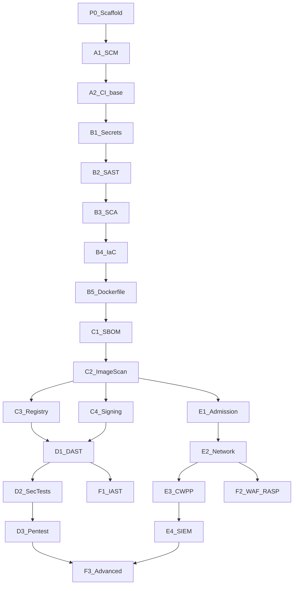

# Мастер-план DevSecOps CI/CD (GitLab + GitHub, Kubernetes)

## Контекст и источники

Репозиторий сейчас почти пуст: только [`.gitignore`](.gitignore) (игнорирует `.external/*`). В [`.external/`](.external/) лежат первичные материалы:

| Источник | Формат | Роль в мастер-плане |
|----------|--------|---------------------|
| [DAF](.external/DevSecOps-Assessment-Framework-main/) | `DAF_public_RU.md`, `DAF_public_RU.xlsx` | Практики, уровни зрелости (Кирилламида), `miniRoadmap`, маппинг на ГОСТ/SAMM/DSOMM, перечень процессных документов |
| [JCSF](.external/Jet-Container-Security-Framework-main/) | `JCSF v7_public.xlsx`, README | Контейнерная безопасность: nodes, k8s, images, manifests, runtime |
| [Типовой процесс для финтеха](.external/Типовой_процесс_безопасной_разработки_для_финтеха.pdf) | PDF (диаграмма) | Поток SDLC: MR/PR gates, SBOM, DAST, WAF, RASP, IAST, зоны DEV/UAT/PROD |
| [Карта инструментов DevSecOps](.external/Карта инструментов DevSecOps.pdf) | PDF | Каталог инструментов по классам: SAST, SCA/OSA, IaC, DAST, IAST, RASP, WAF, BCA, fuzzing |

**Важно по PDF:** текст извлекается фрагментарно (схема), поэтому в `.md` фиксируем **интерпретированный процесс** с явными ссылками на источник, а не дословную копию.

**Целевой runtime:** Kubernetes (по вашему выбору) — JCSF и DAF-практики `T-CODE-IMG`, `T-PREPROD-MANSEC`, `T-PROD-RUN` становятся обязательной частью плана.

---

## Ответ: один план на GitLab и GitHub?

**Да, один мастер-план возможен.** Стратегия — **platform-agnostic stages + platform profiles**:

- Общая логика этапов, gates, артефактов, ролей — в `docs/`
- Платформенные отличия — в отдельных профилях:
  - **GitLab:** `.gitlab-ci.yml`, include templates (`Security/SAST`, `Security/Secret-Detection`, `Security/Dependency-Scanning`, `Security/Container-Scanning`, `Security/IaC-Scanning`)
  - **GitHub:** `.github/workflows/*.yml`, reusable workflows, composite actions, Dependabot, CodeQL

Различия (не дублировать в мастер-плане, а описать в профиле):

| Аспект | GitLab | GitHub |
|--------|--------|--------|
| Встроенный SAST/IaC/Secrets | GitLab Secure (в лицензии) | CodeQL + marketplace actions |
| MR/PR checks | Merge Request pipelines + approval rules | Branch protection + required checks |
| Registry scan | Container Scanning + Dependency proxy | ghcr + Trivy/Grype action |
| Policy as code | Scan result policies (Ultimate) | OPA/conftest + branch rules |

На этапе мастер-плана **не пишем полные YAML-пайплайны** — только архитектуру, матрицу контролей и ссылки на будущие подфазы.

---

## Целевая структура репозитория

```
ci-cd_template/
├── README.md                          # входная точка: что это, как читать, ссылки
├── docs/
│   ├── 00-master-plan.md              # этот документ-синтез (главный)
│   ├── 01-sdlc-process.md             # SDLC из финтех-PDF + DAF домены
│   ├── 02-pipeline-architecture.md    # стадии CI/CD, gates, артефакты, среды
│   ├── 03-security-controls.md        # SAST/IaC/SCA/DAST/IAST/RASP/WAF + secrets/containers
│   ├── 04-tooling-catalog.md          # из PDF + рекомендации по выбору
│   ├── 05-maturity-roadmap.md         # Кирилламида + miniRoadmap + фазы внедрения
│   ├── 06-kubernetes-runtime.md       # JCSF + DAF runtime/preprod
│   ├── 07-governance-and-docs.md      # регламенты из листа «Документы для процессов DSO»
│   ├── 08-compliance-gost-56939.md    # выжимка маппинга из DAF xlsx
│   ├── platforms/
│   │   ├── gitlab.md                  # профиль GitLab CI
│   │   └── github.md                  # профиль GitHub Actions
│   ├── phases/                        # одна подфаза = один .md (малый diff в PR)
│   │   ├── P0-scaffold.md
│   │   ├── A1-scm-hardening.md
│   │   └── ...                        # см. раздел «Подфазы» ниже
│   └── references/
│       └── sources.md
├── config/
│   └── security-gate-policy.yaml      # растёт по подфазам (severity thresholds)
└── templates/
    ├── gitlab/
    │   ├── .gitlab-ci.yml             # тонкий entrypoint, include jobs/
    │   └── jobs/                      # по одному файлу на подфазу B–D
    ├── github/
    │   ├── ci-base.yml
    │   └── workflows/                 # reusable + один job-файл на подфазу
    └── k8s/                           # подфазы E (admission, network, …)
```

`.external/` остаётся reference-only (уже в `.gitignore`).

---

## Архитектура пайплайна (ядро мастер-плана)

Диаграмма для [`docs/02-pipeline-architecture.md`](docs/02-pipeline-architecture.md):

```mermaid
flowchart LR
  subgraph shiftLeft [ShiftLeft_DEV]
    IDE[IDE_plugins]
    PreCommit[pre_commit_hooks]
    MR[MR_PR_pipeline]
  end
  subgraph build [Build_Artifact]
    Lint[linters]
    SAST[SAST]
    Secrets[secret_scan]
    SCA[OSA_SCA_SBOM]
    IaC[iac_scan]
    Docker[dockerfile_scan]
    Unit[unit_tests]
    Build[build_sign]
    ImgScan[container_scan]
  end
  subgraph preprod [Preprod_QA]
    DeployPre[deploy_preprod]
    DAST[DAST_fuzz]
    IAST[IAST_optional]
    SecTest[security_func_tests]
    Pentest[pentest_gate]
  end
  subgraph prod [Prod_Runtime]
    CD[deploy_prod]
    WAF[WAF_API_Sec]
    RASP[RASP_runtime]
    CSPM[container_runtime_CWPP]
    SIEM[siem_correlation]
    VulnMon[continuous_SCA_SBOM]
  end
  IDE --> PreCommit --> MR
  MR --> Lint --> SAST --> Secrets --> SCA --> IaC --> Docker --> Unit --> Build --> ImgScan
  ImgScan --> DeployPre --> DAST --> IAST --> SecTest --> Pentest
  Pentest --> CD --> WAF --> RASP --> CSPM --> SIEM
  CD --> VulnMon
```



### Стадии и Security Gates (синтез DAF + финтех-PDF)

| Стадия | Когда | Контроли | DAF-практики (примеры) | Gate |
|--------|-------|----------|------------------------|------|
| **0. Plan/Design** | До кода | Threat model, требования ИБ, app risk | `P-REQ-TM-*`, `P-REQ-RD-*` | Чеклист в трекере |
| **1. Dev (local)** | IDE / pre-commit | Лёгкий SAST, secrets, linters | `T-CODE-SST-2-4`, `T-CODE-SECDN-*` | Блок commit (опционально) |
| **2. MR/PR** | На каждый MR | SAST diff, SCA, secrets, IaC, лишние файлы | `T-DEV-SRC-2-2`, `T-CODE-SC-2-4` | MR merge blocked |
| **3. Build** | main/trunk CI | Full SAST, SBOM, image scan, unit tests | `T-CODE-SST-3-1`, `T-ADI-ART-3-1`, `T-CODE-IMG-2-1` | Pipeline fail |
| **4. Preprod** | QA/UAT | DAST, func sec tests, IaC/manifest re-check | `T-PREPROD-DAST-*`, `T-PREPROD-SECTEST-*` | Release candidate gate |
| **5. Release** | Перед PROD | Pentest (критичные), подпись артефактов | `T-PREPROD-PENTEST-*`, `T-ADI-ART-4-*` | CAB / SecChamp approve |
| **6. Prod deploy** | CD | WAF/API policies, admission, network policies | `T-PROD-NETWORK-*`, `T-PROD-RUN-*` | Automated + manual for crit |
| **7. Runtime** | Continuous | RASP, container CWPP, passive DAST, SBOM monitor | `T-PROD-DAST-1-2`, JCSF containers | Alerting, не блок CI |

Особые режимы из финтех-PDF (зафиксировать в `01-sdlc-process.md`):
- **Trunk-based** как основной сценарий
- **Bugfix fast-path** — упрощённые gates с принятием риска и отложенными проверками
- **Feature branch env** — допустимо отдельное окружение на ветку

---

## Матрица контролей безопасности

Документ [`docs/03-security-controls.md`](docs/03-security-controls.md) — центральный для вашего списка:

| Контроль | SDLC-точка | Что сканируем | Инструменты (из PDF, примеры) | DAF | JCSF/K8s |
|----------|------------|---------------|-------------------------------|-----|----------|
| **SAST** | IDE, MR, nightly full | Исходный код, custom rules | Semgrep, CodeQL, SonarQube, PT AI, GitLab SAST | `T-CODE-SST` | — |
| **Secret scan** | SCM, MR, logs | Код, IaC, образы | gitleaks, detect-secrets, GitLab Secret Detection | `T-CODE-SECDN` | — |
| **OSA/SCA** | MR, build, runtime | Зависимости, SBOM, OSS policy | Snyk, Dependency-Track, Trivy, Xray, Mend | `T-CODE-SC`, `T-ADI-DEP` | — |
| **IaC Scan** | MR, pre-deploy | Terraform, K8s manifests, Helm | Checkov, tfsec, kics, Terrascan, Checkov | `T-PREPROD-MANSEC` | JCSF `man` domain |
| **Container scan** | Build, registry periodic | Образы CVE/misconfig | Trivy, Grype, Clair | `T-CODE-IMG` | JCSF `img` |
| **DAST** | Preprod (+ passive prod) | Web/API, auth flows, fuzz | ZAP, Burp CI, PT BB | `T-PREPROD-DAST`, `T-PROD-DAST` | — |
| **IAST** | Preprod (опционально prod) | Runtime в тестовой среде | Contrast, Seeker, Hdiv | *расширение* (финтех-PDF) | — |
| **RASP** | Prod runtime | Аномалии, атаки в приложении | Contrast, custom APM rules | *финтех-PDF + `T-PROD-EVENTS`* | JCSF runtime |
| **WAF / API Sec** | Prod edge | L7, API policies | WAF + API gateway policies | `T-PROD-NETWORK-2-2` | Gen L4/L7 |
| **Runtime K8s** | Prod | Admission, PSP/PSA, network policy | Kyverno, OPA Gatekeeper, Falco, Cilium | `T-PROD-RUN` | JCSF `orchr`, `containers` |

**Пробелы DAF:** IAST/RASP/WAF не выделены отдельными поддоменами — в мастер-плане явно помечаем как **расширение из финтех-процесса**, маппим на ближайшие DAF-практики (`T-PROD-NETWORK`, `T-PROD-EVENTS`, `T-PROD-RUN`).

---

## Зрелость и поэтапное внедрение

Сводка уровней — в [`docs/05-maturity-roadmap.md`](docs/05-maturity-roadmap.md) (Кирилламида 0–7, `miniRoadmap` из DAF xlsx).

### Принцип минимального diff

Каждая подфаза = **отдельный PR** со строгими лимитами:

| Правило | Зачем |
|---------|-------|
| ≤ 5 файлов в PR | Быстрый review, понятный scope |
| +1 job-файл в `templates/*/jobs/` | Не раздувать monolithic YAML |
| +1 строка `include` в entrypoint CI | Подключение без переписывания |
| +1 секция в `security-gate-policy.yaml` | Единая политика gates |
| +1 файл `docs/phases/XX.md` | Трассировка: цель → DAF → файлы → критерии |
| Сначала **warn**, потом **block** | Подфаза N = warn; N+1 или hotfix = block для того же контроля |
| GitLab и GitHub **параллельно**, зеркально | Один PR, два job-файла с одинаковым контрактом (SARIF, exit code) |

Зависимости: `P0 → A* → B* → C* → D*` (линейно по CI); `E*` параллельно с `C3+` (инфра-кластер); `F*` после `D1` + `E1`.

---

## Подфазы (детализация)

### P0 — Scaffold (только документация)

**Цель:** навигационный каркас без исполняемого CI.

| Поле | Значение |
|------|----------|
| DAF | обзор всех доменов (без оценки) |
| Diff | ~12–14 новых `.md`, **0** YAML |
| Файлы | `README.md`, `docs/00`…`08`, `docs/platforms/*`, `docs/references/sources.md`, `docs/phases/P0-scaffold.md` |
| Критерий готовности | Ссылки между docs валидны; матрица контролей в `03` полная; README объясняет порядок подфаз |

**Не делать в P0:** `templates/`, `config/`, реальные pipeline.

---

### A1 — SCM hardening

**Цель:** защита репозитория до любых security-сканеров.

| Поле | Значение |
|------|----------|
| DAF | `T-DEV-SCM-1-*`, `T-DEV-SRC-1-5`, `T-DEV-SRC-2-6` |
| Diff | 3 файла: `docs/phases/A1-scm-hardening.md`, дополнение `platforms/gitlab.md`, `platforms/github.md` |
| Deliverable | Чеклисты (не автоматизация): protected `main`, 2 approvals, linear history, no force-push для dev, CODEOWNERS шаблон, signed commits (рекомендация) |
| Gate | Ручной аудит + скриншоты настроек в тикете |
| GitLab | Settings → Repository → Protected branches; MR approvals; `PUSH_RULES` |
| GitHub | Branch protection rules; required reviewers; `CODEOWNERS` в корне шаблона |

---

### A2 — CI/CD as Code (базовый каркас)

**Цель:** пустой, но правильный pipeline без security jobs.

| Поле | Значение |
|------|----------|
| DAF | `T-DEV-CICD-1-3`, `T-DEV-CICD-1-1`, `T-DEV-BLD-1-4` |
| Diff | 5 файлов: `templates/gitlab/.gitlab-ci.yml`, `templates/gitlab/jobs/_base.yml`, `templates/github/ci-base.yml`, `config/security-gate-policy.yaml` (только `version` + `defaults`), `docs/phases/A2-cicd-base.md` |
| Stages | `validate → test → build` (deploy — заглушка `when: manual`) |
| Rules | MR pipeline + main pipeline; запрет `[skip ci]` через push rule (GitLab) / workflow `paths-ignore` policy (GitHub) |
| Jobs | `lint` (placeholder), `unit-test` (allow_failure: true до подключения реальных тестов) |
| Критерий | Pipeline зелёный на пустом репо-форке; логи централизуются (описание куда — в phase doc) |

---

### B1 — Secret detection

**Цель:** первый автоматический контроль в MR.

| Поле | Значение |
|------|----------|
| DAF | `T-CODE-SECDN-1-1`, `T-CODE-SECDN-2-1` |
| Diff | +3: `jobs/secret-scan.yml` (GL+GH), `security-gate-policy.yaml` → `secrets: { block: [] }` warn, `docs/phases/B1-secrets.md` |
| Инструменты | GitLab: `Secret-Detection` template; GitHub: `gitleaks/gitleaks-action` или `trufflesecurity/trufflehog` |
| Trigger | `merge_request_event` + `push` to main |
| Gate (B1) | **warn only**; B1.1 (отдельный микро-PR) → block на verified secrets |
| Артефакт | SARIF / JSON report, 30 days retention |

---

### B2 — SAST (MR / diff scope)

| Поле | Значение |
|------|----------|
| DAF | `T-CODE-SST-2-3`, `T-CODE-SST-1-2`, `T-DEV-SRC-3-6` |
| Diff | +3 job files, policy `sast: { severity_block: [critical, high] }`, `docs/phases/B2-sast.md` |
| Инструменты | GitLab: `SAST.gitlab-ci.yml`; GitHub: CodeQL (`analyze` workflow) **или** Semgrep OSS action |
| Scope | MR: diff-only / changed files; main: full scan (nightly cron job — опционально +1 файл `nightly.yml`) |
| Gate | Block Critical/High на MR; Medium → comment bot |
| Ignore policy | Документировать запрет слепого `.semgrepignore` без review (`T-DEV-SRC-3-6`) |

---

### B3 — OSA/SCA + SBOM draft

| Поле | Значение |
|------|----------|
| DAF | `T-CODE-SC-2-4`, `T-ADI-DEP-3-2`, `T-ADI-DEP-1-5` |
| Diff | +3 jobs, policy `sca:`, `docs/phases/B3-sca.md` |
| Инструменты | GitLab: `Dependency-Scanning`; GitHub: `dependency-review-action` + Dependabot config **или** Trivy fs |
| SBOM | CycloneDX JSON как artifact (`sbom-draft.json`); без подписи пока |
| Gate | Block: известные Critical CVE в **прямых** зависимостях; транзитивные — warn до C2 |
| OSS policy | Запрет `latest` tag в lockfiles (lint script ~20 строк, тот же PR или B3.1) |

---

### B4 — IaC scan

| Поле | Значение |
|------|----------|
| DAF | `T-PREPROD-MANSEC-2-1`, `T-PROD-ACCESS-1-3` |
| Diff | +3 jobs, policy `iac:`, `docs/phases/B4-iac.md` |
| Paths | `**/*.tf`, `**/k8s/**`, `**/helm/**`, `docker-compose*.yml` |
| Инструменты | GitLab: `IaC-Scanning`; GitHub: `bridgecrewio/checkov-action` или `aquasecurity/tfsec-action` |
| Gate | Block High/Critical misconfigs на MR |
| JCSF trace | `man` domain — ссылка в phase doc на JCSF `Man-*` L1 |

---

### B5 — Dockerfile lint

| Поле | Значение |
|------|----------|
| DAF | `T-CODE-DOCKERFS-2-1`, `T-PREPROD-MANSEC-1-1` |
| Diff | +2 jobs (hadolint/checkov docker), `docs/phases/B5-dockerfile.md` |
| Trigger | only if `Dockerfile*` changed |
| Gate | warn → block после 2 спринтов стабилизации (зафиксировать в policy changelog) |

**Контрольная точка B:** MR pipeline содержит 5 security jobs; все публикуют SARIF в единый формат; `03-security-controls.md` — колонка «статус: baseline».

---

### C1 — SBOM как release artifact

| Поле | Значение |
|------|----------|
| DAF | `T-ADI-ART-3-1`, `T-CODE-SC-2-3` |
| Diff | +2 jobs (`sbom-generate`), расширить `build` stage, `docs/phases/C1-sbom.md` |
| Инструменты | Syft / CycloneDX CLI / GitLab dependency-scan artifact |
| Output | `sbom.cdx.json` + SPDX опционально; привязка к `CI_COMMIT_SHA` |
| Gate | SBOM обязателен на main; отсутствие = fail |

---

### C2 — Container image scan

| Поле | Значение |
|------|----------|
| DAF | `T-CODE-IMG-2-1`, `T-CODE-IMG-4-2` |
| Diff | +2 jobs post-`docker build`, policy `container:`, `docs/phases/C2-image-scan.md` |
| Инструменты | GitLab: `Container-Scanning`; GitHub: `aquasecurity/trivy-action` |
| Gate | Block Critical OS/pkg CVE; registry periodic scan — **только документ** в `06-kubernetes-runtime.md` (без cron в этом PR) |
| JCSF | `Img-1-*`, `Img-2-*` |

---

### C3 — Trusted registry & pull policy

| Поле | Значение |
|------|----------|
| DAF | `T-ADI-ART-1-1`, `T-ADI-ART-2-1`, `T-CODE-SC-2-2` |
| Diff | 2–3 файла: `docs/phases/C3-registry.md`, `k8s/cluster/image-pull-policy.md`, дополнение `06-kubernetes-runtime.md` |
| CI diff | Минимальный: env `REGISTRY=registry.internal/...` в `_base.yml` |
| K8s | `imagePullSecrets`, `Always` + digest pin doc; GitLab Dependency Proxy / GH Packages — в platform doc |
| Gate | Pipeline pull только из internal proxy (network doc, не код) |

---

### C4 — Artifact signing (optional tier)

| Поле | Значение |
|------|----------|
| DAF | `T-ADI-ART-4-1`, `T-ADI-ART-4-3`, `T-DEV-SRC-3-3` |
| Diff | +2 jobs cosign/sign, `docs/phases/C4-signing.md` |
| Gate | Подпись образа обязательна на main; verify в deploy job (заглушка) |
| Зависимость | Требует C2 (есть образ) |

**Контрольная точка C:** release bundle = image + SBOM + scan reports + (опц.) signature.

---

### D1 — Deploy preprod + DAST

| Поле | Значение |
|------|----------|
| DAF | `T-PREPROD-DAST-2-4`, `T-PREPROD-DAST-2-2` |
| Diff | +3: `jobs/deploy-preprod.yml`, `jobs/dast.yml`, `docs/phases/D1-dast.md` |
| Trigger | `main` deploy → preprod; DAST: `workflow_dispatch` или label `run-dast` на MR |
| Инструменты | OWASP ZAP baseline/full scan / GitLab DAST template (если лицензия) |
| Gate | High/Critical findings → тикет; block release candidate при накопленном debt (policy) |
| Env | Синтетические данные (финтех-PDF: зона UAT) |

---

### D2 — Security functional tests

| Поле | Значение |
|------|----------|
| DAF | `T-PREPROD-SECTEST-2-2`, `T-PREPROD-SECTEST-3-1` |
| Diff | +2: `tests/security/README.md`, `jobs/sec-func-tests.yml`, `docs/phases/D2-sec-tests.md` |
| Содержимое | 5–10 автотестов (auth bypass, IDOR шаблон, security headers) — pytest/k6 |
| Gate | ≥5% security tests automated (DAF L2); target 20% в F3 |

---

### D3 — Pentest & release gate

| Поле | Значение |
|------|----------|
| DAF | `T-PREPROD-PENTEST-2-1`, `T-PREPROD-PENTEST-1-1` |
| Diff | 2 файла: `docs/phases/D3-pentest.md`, `docs/release-gate-checklist.md` |
| CI diff | **0** — только процесс: SecChamp approve template в MR description |
| Gate | Критичные системы: pentest report < 12 мес |

---

### E1 — K8s admission policies

| Поле | Значение |
|------|----------|
| DAF | `T-PROD-RUN-1-1`, `T-PROD-RUN-2-1` |
| JCSF | `Orch-2-13`, `Orch-3-1` |
| Diff | `templates/k8s/admission/` (2–3 Policy: no privileged, require limits, trusted registry) + `docs/phases/E1-admission.md` |
| Gate | Deploy job dry-run / `kubectl apply --server-side` с rejection test |
| CI | Conftest test admission policies в `validate` stage (+1 job, ~30 строк) |

---

### E2 — Network policies (L4)

| Поле | Значение |
|------|----------|
| DAF | `T-PROD-NETWORK-2-1`, `T-PROD-NETWORK-3-1` |
| JCSF | `Gen-1-3` |
| Diff | `templates/k8s/network/default-deny.yml` + namespace allowlist + `docs/phases/E2-network.md` |
| CI | `kubeconform` / `kubectl apply --dry-run` в validate |

---

### E3 — Runtime CWPP / Falco

| Поле | Значение |
|------|----------|
| DAF | `T-PROD-RUN-3-1`, `T-PROD-EVENTS-2-1` |
| JCSF | `containers` domain L2+ |
| Diff | `templates/k8s/runtime/falco-values.yaml` stub + `docs/phases/E3-cwpp.md` |
| CI diff | **0** — Helm deploy вне app pipeline |
| Gate | Алерт на exec shell в prod pod |

---

### E4 — SIEM correlation

| Поле | Значение |
|------|----------|
| DAF | `T-PROD-EVENTS-3-1`, miniRoadmap «Container Security → SIEM» |
| Diff | `docs/phases/E4-siem.md` + `templates/siem/rules/container-security/` (2 example rules) |
| CI diff | **0** |

**Контрольная точка E:** кластер отклоняет privileged; default-deny network; Falco → SIEM.

---

### F1 — IAST (preprod)

| Поле | Значение |
|------|----------|
| Источник | финтех-PDF (IAST в зоне тестирования) |
| DAF (ближайшее) | `T-PREPROD-DAST-3-3` (бизнес-логика в тестах) |
| Diff | `docs/phases/F1-iast.md` + опционально `jobs/iast-preprod.yml` (agent inject hook) |
| Gate | Не блокирует CI по умолчанию; findings → ASTO/Defect DOJO |
| Зависимость | D1 (preprod стабилен) |

---

### F2 — WAF / API Sec + RASP (prod)

| Поле | Значение |
|------|----------|
| DAF | `T-PROD-NETWORK-2-2`, финтех-PDF WAF/API Sec/RASP |
| Diff | `docs/phases/F2-rasp-waf.md` — **только документация и runbooks** |
| Содержимое | WAF temporary rules process; API gateway policy lifecycle; RASP alerting ≠ pipeline gate |
| CI diff | **0** (намеренно — runtime controls вне repo pipeline) |

---

### F3 — Advanced continuous assurance

| Поле | Значение |
|------|----------|
| DAF | `T-PROD-DAST-1-2`, `T-ADI-DEP-4-1`, `T-PROD-PENTEST-3-1` |
| Diff | `jobs/nightly-full-sast.yml`, `jobs/sbom-monitor.yml` (doc), `docs/phases/F3-advanced.md` |
| Практики | Passive prod DAST (mirror traffic); SBOM signature verify; Bug Bounty program outline; Red Team cadence |
| Gate | SBOM drift alert; new CVE in prod SBOM → авто-тикет |

---

## Карта подфаз → файлы (сводка)

| Подфаза | Новые/изменённые пути | Security controls |
|---------|----------------------|-------------------|
| P0 | `docs/**`, `README.md` | все (описание) |
| A1 | `docs/phases/A1*`, `platforms/*` | — |
| A2 | `templates/*/ci-base`, `config/security-gate-policy.yaml` | — |
| B1 | `jobs/secret-scan.*` | secrets |
| B2 | `jobs/sast.*` | SAST |
| B3 | `jobs/sca.*`, Dependabot | OSA/SCA |
| B4 | `jobs/iac-scan.*` | IaC |
| B5 | `jobs/dockerfile-lint.*` | IaC/docker |
| C1 | `jobs/sbom.*` | SCA/SBOM |
| C2 | `jobs/container-scan.*` | container |
| C3 | `docs` + env registry | supply chain |
| C4 | `jobs/sign.*` | integrity |
| D1 | `jobs/deploy-preprod.*`, `dast.*` | DAST |
| D2 | `tests/security/`, `jobs/sec-func.*` | sec tests |
| D3 | `release-gate-checklist.md` | pentest process |
| E1–E4 | `templates/k8s/**`, `siem/**` | runtime K8s |
| F1 | `jobs/iast.*` (opt) | IAST |
| F2 | docs only | WAF, RASP |
| F3 | `jobs/nightly.*` | passive DAST, SBOM monitor |

**Итого исполняемых PR после P0:** ~18–20 мелких PR вместо 6 крупных.

### Граф зависимостей подфаз



---

## Платформенные профили (кратко)

### [`docs/platforms/gitlab.md`](docs/platforms/gitlab.md)
- Pipeline stages: `validate → test → build → security → deploy → post-deploy`
- Includes: `Security/SAST.gitlab-ci.yml`, `Security/Secret-Detection`, `Security/Dependency-Scanning`, `Security/Container-Scanning`, `Security/IaC-Scanning`
- MR-only jobs: `rules: if $CI_PIPELINE_SOURCE == "merge_request_event"`
- Protected branches, approval rules, `CODEOWNERS`, signed commits (`T-DEV-SRC-3-3`)
- Container Registry scanning + Dependency Proxy для OSS firewall (`T-ADI-DEP-2-2`)

### [`docs/platforms/github.md`](docs/platforms/github.md)
- Reusable workflow `security-gates.yml` вызываемый из PR и main
- CodeQL + third-party (Semgrep/Trivy/Checkov) actions
- Branch protection + required status checks
- OIDC для deploy в K8s (без long-lived secrets)
- Dependabot + `dependency-review-action` на PR

Общие **контракты** между платформами (описать в `02-pipeline-architecture.md`):
- Единый формат SARIF для агрегации findings
- Единая политика severity gate (Critical/High block, Medium warn)
- Единый `sbom.spdx.json` / CycloneDX на артефакт
- Единый шаблон `security-gate-policy.yaml` (thresholds)

---

## Governance и документация

[`docs/07-governance-and-docs.md`](docs/07-governance-and-docs.md) — структурировать из листа **«Документы для процессов DSO»** (371 строка в xlsx):

Обязательный минимум для организации:
1. Положение по безопасной разработке ПО
2. Регламент процесса безопасной разработки
3. Регламент управления уязвимостями
4. Стандарты конфигурации (приложения + инфраструктура)
5. Методика threat modeling
6. Матрица ролей (Dev, DevOps, SecChamp, AppSec, ИБ)

Роли из DAF + финтех-схемы: **Разработчик, SecChamp, Аналитик ИБ, QA, DevOps, Инженер эксплуатации**.

---

## Compliance

[`docs/08-compliance-gost-56939.md`](docs/08-compliance-gost-56939.md) — таблица «практика DAF → пункт ГОСТ» из листа `ГОСТ56939_mapping` (429 строк). Для CI/CD релевантны в первую очередь:
- 5.10 Статический анализ
- 5.11 Динамический анализ
- 5.13–5.16 Сборка, секреты, SCA
- 5.14 Контроль целостности кода (MR gates, signed commits)

---

## Содержание ключевых документов

### [`README.md`](README.md)
- Назначение шаблона (master reference, не готовый прод-пайплайн)
- Навигация по `docs/`
- Как адаптировать под GitLab/GitHub
- Ссылки на `.external` и лицензии Jet Security Team
- Roadmap подфаз (таблица P0 → F3, см. `docs/phases/`)

### [`docs/phases/*.md`](docs/phases/)
- Шаблон каждого файла: **Цель → DAF/JCSF IDs → Файлы PR → Инструменты → Gate (warn/block) → Критерии приёмки → Rollback**
- Один файл = один PR; не объединять B2+B3 в один PR

### [`docs/00-master-plan.md`](docs/00-master-plan.md)
- Executive summary
- Принципы: shift-left, defense in depth, fail closed on critical, CI/CD as code
- Полная диаграмма SDLC + ссылка на детальные docs
- Таблица фаз внедрения
- Decision log (почему K8s, почему dual-platform)

### Остальные docs — по секциям выше, с:
- ID практик DAF (`T-CODE-SST-2-3` и т.д.) как traceability
- ID JCSF (`Orch-2-13`, `Img-*`) для K8s
- Примеры инструментов OSS/commercial из PDF (без vendor lock-in — tier: built-in / OSS / commercial)
- Чеклисты «минимум / рекомендуется / продвинутый»

---

## Метод создания .md из Excel/PDF

При реализации (после подтверждения плана):

1. **DAF xlsx** — Python-скрипт (одноразовый, не коммитить) для извлечения:
   - `miniRoadmap` → timeline в `05-maturity-roadmap.md`
   - `ГОСТ56939_mapping` → сводная таблица в `08-compliance-gost-56939.md`
   - `Документы для процессов DSO` → оглавления в `07-governance-and-docs.md`
2. **JCSF xlsx** — выжимка доменов + top practices L1–L2 в `06-kubernetes-runtime.md`
3. **PDF** — ручная интерпретация swimlane (уже извлечена) в `01-sdlc-process.md`; каталог инструментов — парсинг колонок в `04-tooling-catalog.md`
4. **DAF_public_RU.md** — не копировать целиком; использовать как lookup для ID практик

---

## Что НЕ входит в мастер-план (сознательно)

- Рабочие `.gitlab-ci.yml` / workflow YAML (подфазы B–F)
- Выбор конкретного вендора (даём tiers + примеры)
- MLSecOps-практики (`DAF_MLSO_public_RU.md`) — опциональное приложение позже
- Закрытая часть DAF/JCSF (опросники, детальные how-to)

---

## Критерии готовности

### Мастер-план (P0)
- [ ] 11 markdown-файлов + README + `docs/phases/P0-scaffold.md`
- [ ] Покрыты контроли: SAST, IaC, OSA/SCA, DAST, IAST, RASP, WAF
- [ ] Dual-platform GitLab + GitHub
- [ ] K8s runtime (JCSF) в архитектуре
- [ ] Атрибуция в `references/sources.md`

### Полный шаблон (все подфазы)
- [ ] 18–20 PR по карте подфаз выполнены
- [ ] `config/security-gate-policy.yaml` покрывает все активные gates
- [ ] MR pipeline: secrets + SAST + SCA + IaC + dockerfile (B1–B5)
- [ ] Main pipeline: + SBOM + image scan (+ sign при C4)
- [ ] Preprod: DAST + sec tests (D1–D2)
- [ ] K8s: admission + network + runtime doc (E1–E4)
- [ ] F2 WAF/RASP — runbooks без CI
