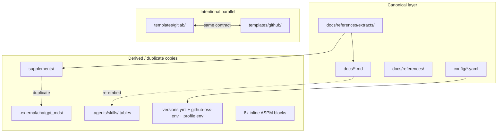

# Максимальный аудит и DRY без потери информации

## Результаты аудита (395 файлов)

Проект уже имеет **осмысленную многослойную архитектуру**, но накопил **5 классов дублирования**:



| Класс | Severity | Пример | Риск при агрессивном DRY |
|-------|----------|--------|--------------------------|
| Три/четырёхкратные копии docs | **High** | Kirillamida в `daf-kirillamida.md`, `05-maturity-roadmap.md`, `devsecops-daf` skill | Потеря PDF-комментариев, GOST 5.1–5.25 |
| `.external` = `supplements/` | **High** | 3 MD файла ~99% идентичны | Низкий (supplements уже в git) |
| Skills re-embed tables | **High** | fintech zones, DAF levels, GOST map | Потеря agent context без ссылок |
| OSS pin mirrors (4+) | **High** | [`config/oss-tool-versions.yaml`](config/oss-tool-versions.yaml) vs [`versions.yml`](templates/gitlab/jobs/oss/versions.yml) vs [`github-oss-env.yml`](config/github-oss-env.yml) vs inline env в [`oss-full.github.yml`](templates/profiles/oss-full.github.yml) | **Drift pins = supply-chain regression** |
| GitLab/GitHub scan shell | **Medium** | 6 пар OSS jobs (gitleaks, semgrep, trivy…) | Схлопывание oss vs vendor = policy break |
| Entry points (README/AGENTS/skills) | **Medium** | 12-skill table ×3, PR rules ×4 | Низкий при link-only |
| Completed plans | **Low–Medium** | 5 plans, все todos done; ghost ref на несуществующий plan | Путаница агентов |

**Что НЕ трогаем (осознанный parallel):**
- GitLab `include:` vs GitHub `workflow_call` — разные orchestration models
- `shift-left` (vendor/unpinned GHA actions) vs `oss-full` (strict pins) — разная supply-chain политика
- `extracts/` — immutable archive, не merge с synthesis
- `.cursor/skills/` stubs → `.agents/skills/` — правильный DRY-паттерн

---

## Каноническая иерархия (целевое состояние)

| Тип контента | Единственный источник правды | Остальное |
|--------------|------------------------------|-----------|
| Факты, таблицы, маппинги | [`docs/`](docs/) + [`docs/references/`](docs/references/) | skills = routing + agent actions |
| Exhaustive tool list (OCR) | [`docs/references/supplements/devsecops_tools.md`](docs/references/supplements/devsecops_tools.md) | [`04-tooling-catalog.md`](docs/04-tooling-catalog.md) = tier + defaults only |
| Финтех процесс (операционный) | [`docs/01-sdlc-process.md`](docs/01-sdlc-process.md) | swimlane = PDF diagram notes; supplement = 12 этапов + GOST |
| SDLC crosswalk | [`docs/references/sdlc-mapping.md`](docs/references/sdlc-mapping.md) | остальные docs — 1 строка + link |
| Kirillamida levels | [`docs/references/daf-kirillamida.md`](docs/references/daf-kirillamida.md) | roadmap = miniRoadmap only |
| Agent rules | [`AGENTS.md`](AGENTS.md) + [`.cursor/rules/phase-impl.mdc`](.cursor/rules/phase-impl.mdc) | skills link, не копируют |
| Skill index | [`AGENTS.md`](AGENTS.md) | README = 1 строка |
| Extract/re-grep commands | [`devsecops-reference-lookup`](.agents/skills/devsecops-reference-lookup/SKILL.md) | domain skills ссылаются |
| OSS tool pins | [`config/oss-tool-versions.yaml`](config/oss-tool-versions.yaml) | **generated** targets |
| Gate logic | [`scripts/gate-check.py`](scripts/gate-check.py) + [`config/security-gate-policy.yaml`](config/security-gate-policy.yaml) | shared on both platforms |

**Принцип безопасности:** перед удалением блока — проверить unique content (grep diff), перенести уникальное в канон, заменить блок на link.

---

## Wave 0 — Baseline (текущие незакоммиченные изменения)

Уже сделано (supplement integration), нужно закоммитить как отдельный PR:
- [`docs/references/supplements/`](docs/references/supplements/) (3 MD + README)
- Обновления [`sources.md`](docs/references/sources.md), [`sdlc-mapping.md`](docs/references/sdlc-mapping.md), skills, README

---

## Wave 1 — Docs / skills / plans (низкий риск, ~6 PR)

### PR 1.1: `.external` → gitignore
- Добавить в [`.gitignore`](.gitignore): `.external/chatgpt_mds/`
- Заметка в [`docs/references/supplements/README.md`](docs/references/supplements/README.md) и [`sources.md`](docs/references/sources.md)
- **Не удалять** extracts или supplements

### PR 1.2: Tooling DRY
- В [`04-tooling-catalog.md`](docs/04-tooling-catalog.md): убрать секцию "Extended catalog" (L165–182), заменить на 2–3 строки + link на supplement
- В [`devsecops-tooling/SKILL.md`](.agents/skills/devsecops-tooling/SKILL.md): убрать дубли "Template defaults" → link на 04 §Выбор для шаблона
- [`devsecops-tooling/reference.md`](.agents/skills/devsecops-tooling/reference.md): link-only для extended lists

### PR 1.3: Fintech / SDLC DRY
- [`fintech-swimlane.md`](docs/references/fintech-swimlane.md): оставить зоны, MR gate, PDF-specific notes (L72+); убрать дубли таблиц, уже есть в `01-sdlc-process.md`
- [`01-sdlc-process.md`](docs/01-sdlc-process.md): обновить "Три модели" → "Четыре модели" + link на supplement (12 этапов)
- Cross-link supplement ↔ swimlane ↔ `08-compliance-gost-56939.md`

### PR 1.4: Kirillamida / roadmap DRY
- [`05-maturity-roadmap.md`](docs/05-maturity-roadmap.md): удалить дублирующую таблицу levels 0–7 (≈L7–27), заменить link на [`daf-kirillamida.md`](docs/references/daf-kirillamida.md)
- [`devsecops-daf/SKILL.md`](.agents/skills/devsecops-daf/SKILL.md): algorithm stub + link; убрать embedded levels table
- [`devsecops-daf/reference.md`](.agents/skills/devsecops-daf/reference.md): T-* only; P-* → link на governance skill

### PR 1.5: Skills slim-down (batch 1)
- [`devsecops-secure-sdlc`](.agents/skills/devsecops-secure-sdlc/SKILL.md): убрать stage→template table → link `sdlc-mapping.md`
- [`devsecops-fintech-sdlc`](.agents/skills/devsecops-fintech-sdlc/SKILL.md): убрать zones/MR gate tables → link `01-sdlc-process.md`
- [`devsecops-gost`](.agents/skills/devsecops-gost/SKILL.md): убрать GOST table → link `08-compliance-gost-56939.md` (сохранить agent workflow bullets)

### PR 1.6: Entry points + plans hygiene
- [`README.md`](README.md): убрать дубли "Быстрый старт" (L11–19) и skills table → links на quickstart + AGENTS
- [`sources.md`](docs/references/sources.md): убрать skills inventory table
- [`devsecops-template/SKILL.md`](.agents/skills/devsecops-template/SKILL.md): "See AGENTS.md § Rules"; slim repo map
- Fix ghost ref: удалить rule #6 про `devsecops_execution_plan_04e83d47.plan.md` из [`AGENTS.md`](AGENTS.md) и [`phase-impl/reference.md`](.agents/skills/devsecops-phase-impl/reference.md)
- Archive completed plans: frontmatter `status: archived` в 4 completed plans; trim stale gap section в [`devsecops-execution.plan.md`](.cursor/plans/devsecops-execution.plan.md)

**Verification Wave 1:** `scripts/validate-yaml.sh`; manual link check; grep что unique strings из удалённых блоков остались в каноне.

---

## Wave 2 — Pin sync + validation (средний риск, ~3 PR)

### PR 2.1: Pin generator
Новый [`scripts/generate-oss-pins.sh`](scripts/generate-oss-pins.sh) (или Python + PyYAML):
- Input: [`config/oss-tool-versions.yaml`](config/oss-tool-versions.yaml)
- Outputs (generated, marked `# GENERATED — do not edit`):
  - [`templates/gitlab/jobs/oss/versions.yml`](templates/gitlab/jobs/oss/versions.yml)
  - [`config/github-oss-env.yml`](config/github-oss-env.yml)
  - env block fragment for [`oss-full.github.yml`](templates/profiles/oss-full.github.yml)
- Заменить hardcodes в [`sbom.yml`](templates/gitlab/jobs/sbom.yml), [`dockerfile-lint.yml`](templates/gitlab/jobs/dockerfile-lint.yml), [`_base.yml`](templates/gitlab/jobs/_base.yml) на `${OSS_*}` refs где возможно

### PR 2.2: Pin drift validator
Новый [`scripts/validate-pin-sync.sh`](scripts/validate-pin-sync.sh):
- Сравнивает manifest vs all generated targets
- Расширить [`validate-oss-pins.sh`](scripts/validate-oss-pins.sh): добавить GitHub paths
- Подключить в [`validate-yaml.sh`](scripts/validate-yaml.sh) и [`.github/workflows/validate-template.yml`](.github/workflows/validate-template.yml)

### PR 2.3: Docs + runbook
- Обновить [`docs/runbooks/oss-tool-pinning.md`](docs/runbooks/oss-tool-pinning.md): "edit manifest → run generator → validate"
- Merge shared content [`gitlab-oss-full.md`](docs/platforms/gitlab-oss-full.md) + [`github-oss-full.md`](docs/platforms/github-oss-full.md) → новый [`docs/platforms/oss-full-shared.md`](docs/platforms/oss-full-shared.md); platform docs = delta only
- Fix typo `github-oss-env.yaml` → `.yml`

**Verification Wave 2:** run generator; `validate-pin-sync.sh`; `adopt.sh --dry-run` both platforms; diff generated files = zero unexpected changes after regen.

---

## Wave 3 — CI boilerplate DRY (средний риск, ~3 PR)

### PR 3.1: GitHub composite action `gate-and-export`
Новый [`.github/actions/gate-and-export/action.yml`](templates/github/actions/gate-and-export/action.yml) (копируется adopt.sh):
- Inputs: control, report path, policy path
- Steps: SARIF fallback → `gate-check.py` → conditional `aspm-export.py` → `upload-sarif@v3`
- Заменить 8 inline blocks в [`jobs/oss/*.yml`](templates/github/workflows/jobs/oss/) — **поведение 1:1**, только extract

### PR 3.2: GitHub reusable `base-validate.yml`
- Extract lint + unit-test из 6 GitHub profiles → [`templates/github/workflows/base-validate.yml`](templates/github/workflows/base-validate.yml)
- Profiles вызывают `workflow_call` вместо inline 15–40 lines
- GitLab уже DRY через [`_base.yml`](templates/gitlab/jobs/_base.yml) — без изменений

### PR 3.3: Platform docs for asymmetry
- Document в oss-full-shared: GitLab Helm deploy / sbom-upload / conftest vs GitHub GHCR-only post-build
- **Не** unify oss vs vendor GitHub job trees (PR 3.x explicitly out of scope)

**Verification Wave 3:** `validate-github-oss.sh`; run sample-app workflow locally if possible; compare SARIF artifact names and gate exit codes before/after.

---

## Wave 4 — Optional future (не в первой итерации)

| Item | Why deferred |
|------|--------------|
| Scan-spec YAML → platform renderer | High complexity; 6 job pairs manageable with composite action |
| Unify GitLab+GitHub oss job files | Platform syntax fundamentally different |
| Merge `03-security-controls` + `sdlc-mapping` | Different audiences; cross-link sufficient |
| Auto-regenerate `.cursor/skills/` stubs | Low ROI; stubs stable |

---

## Anti-patterns (запрещено)

1. **Удалять** `extracts/`, supplements, или `.external` vendor xlsx/pdf paths из docs
2. **Схлопывать** `shift-left` и `oss-full` GitHub jobs в один parameterized set
3. **Удалять** English agent summaries без замены на "Read doc §X + 3 action bullets"
4. **Менять** gate thresholds или scan CLI args при DRY (только structure)
5. **Большие PR** (>5 files) — нарушает собственные правила repo

---

## Verification checklist (каждая волна)

```bash
scripts/validate-yaml.sh
scripts/validate-policy.py
scripts/validate-oss-pins.sh      # after Wave 2
scripts/validate-pin-sync.sh      # new, Wave 2
scripts/validate-github-oss.sh
scripts/adopt.sh --profile oss-full --platform gitlab --target /tmp/t --dry-run
scripts/adopt.sh --profile oss-full --platform github --target /tmp/t --dry-run
```

Manual: grep removed content strings → must exist in canonical doc; review CHANGELOG entry per wave.

---

## Ожидаемый результат

| Metric | Before | After |
|--------|--------|-------|
| ChatGPT MD copies in repo | 2 locations | 1 (`supplements/`) |
| Kirillamida table copies | 3+ | 1 |
| OSS pin edit points | 4+ manual | 1 manifest + generator |
| GitHub ASPM boilerplate | ~8× copy-paste | 1 composite action |
| Skills embedded tables | ~150 lines duplicate | links + agent actions |
| Drift risk | High (no cross-check) | CI fails on pin mismatch |

**Features preserved:** all profiles, all jobs, all reference material, extracts, supplements, agent skill triggers, GitLab/GitHub parity of gate contracts.
