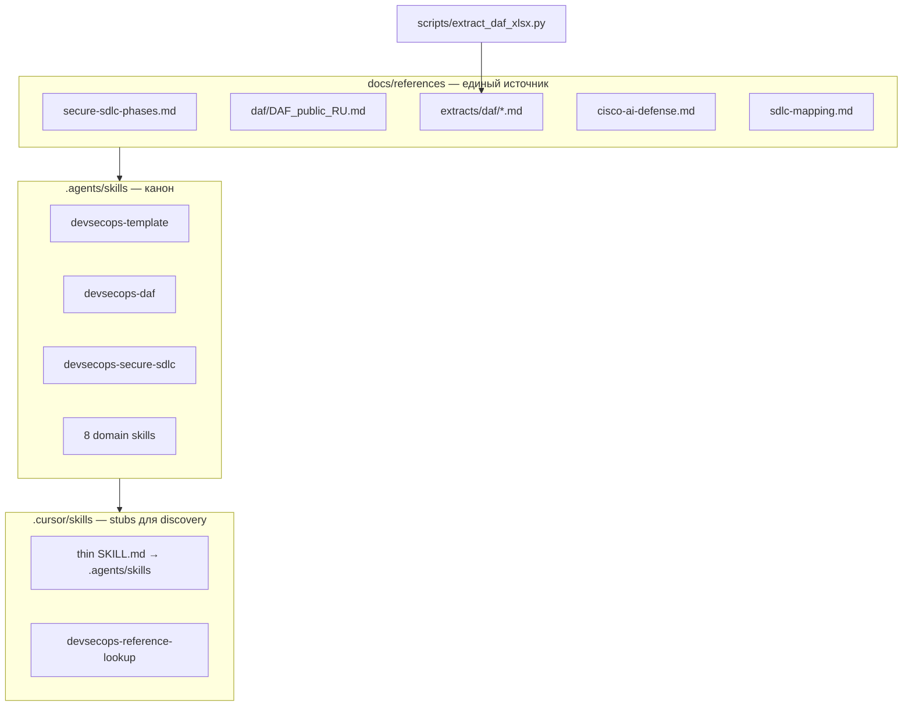

# Миграция `.external` + Secure SDLC phases + skills layout

## Контекст

**Сейчас в [`.external/`](.external/)** (16 файлов, gitignored):

| Файл | Размер/тип | Уже синтезировано в repo? |
|------|------------|---------------------------|
| [`phases.md`](.external/phases.md) | 8-stage Secure SDLC | **Нет** — новый взгляд |
| [`DAF_public_RU.md`](.external/DevSecOps-Assessment-Framework-main/DAF_public_RU.md) | ~684 строк | Частично (`daf-kirillamida.md`) |
| [`DAF_MLSO_public_RU.md`](.external/DevSecOps-Assessment-Framework-main/DAF_MLSO_public_RU.md) | ~909 строк | Частично (`10-mlsecops-appendix.md`) |
| `DAF_public_RU.xlsx` | binary | extracts в skills, не в docs |
| `JCSF v7_public.xlsx` | binary | упоминания в `06-kubernetes-runtime.md` |
| 2× PDF (финтех, карта инструментов) | ~370 KB | `fintech-swimlane.md`, `04-tooling-catalog.md` |
| [`CISCO_AI_DEFENCE.md`](.external/CISCO_AI_DEFENCE.md) | md | `cisco-ai-defense.md` (краткая выжимка) |
| README/LICENSE/images | meta | attribution only |

**Проблема:** ~40 ссылок на `.external/` в docs/skills/AGENTS; agents без локальной копии не работают; `phases.md` не интегрирован.

**Выбор по xlsx:** только **extracted markdown/CSV** в [`docs/references/extracts/`](docs/references/extracts/) — без коммита xlsx (ваш выбор).

---

## Целевая архитектура



**Правило:** после миграции ни один skill/doc не содержит путей `.external/`; `extract_daf_xlsx.py` читает опциональный локальный xlsx только для **ре-генерации** extracts (dev maintainer workflow).

---

## Волна SDLC — интеграция `phases.md` (4 PR)

### SDLC-1: Справочник 8 этапов

Создать [`docs/references/secure-sdlc-phases.md`](docs/references/secure-sdlc-phases.md) — перенос содержимого [`phases.md`](.external/phases.md) без потери структуры Plan→Monitor.

### SDLC-2: Маппинг трёх взглядов

Создать [`docs/references/sdlc-mapping.md`](docs/references/sdlc-mapping.md):

| Secure SDLC (8) | DAF / Kirillamida | Template P0–F3 | Pipeline stage |
|-----------------|-------------------|----------------|----------------|
| Plan | P-REQ-TM, design | P0, A1 | pre-commit / tracker |
| Code | T-CODE-SST/SC | B1–B6 | MR security |
| Build | T-DEV-BLD, T-ADI-ART | A2, C1–C2 | build |
| Test | T-PREPROD-* | D1–D2 | preprod |
| Release | D3, pentest | C4, D3 | release gate |
| Deploy | T-PROD-NETWORK | E1–E2, F2 | CD |
| Operate | T-PROD-RUN/EVENTS | E3–E4, F2 | runtime |
| Monitor | F3 SBOM monitor | F3 | continuous |

Дополнить gaps из `phases.md`, которых нет в текущем шаблоне: **Misuse/Abuse cases**, **Configuration Drift**, **Performance/Chaos/Resilience testing**, **PKI/IDS** — пометить как process/runtime (не CI job) или future optional.

### SDLC-3: Обновить core docs (≤5 файлов/PR)

- [`docs/01-sdlc-process.md`](docs/01-sdlc-process.md) — секция «Три модели SDLC» + ссылка на mapping
- [`docs/03-security-controls.md`](docs/03-security-controls.md) — колонка `Secure SDLC stage`
- [`docs/02-pipeline-architecture.md`](docs/02-pipeline-architecture.md) — диаграмма Plan→Monitor рядом с shift-left
- [`docs/05-maturity-roadmap.md`](docs/05-maturity-roadmap.md) — optional row per Secure SDLC stage

### SDLC-4: Skill + stub

- Новый `.agents/skills/devsecops-secure-sdlc/SKILL.md`
- Stub `.cursor/skills/devsecops-secure-sdlc/SKILL.md`

---

## Волна MIG — полный перенос `.external` (8 PR)

### MIG-1: DAF markdown → repo

```
docs/references/daf/
  DAF_public_RU.md      ← copy from .external (with LICENSE header)
  DAF_MLSO_public_RU.md
  LICENSE               ← Jet Security attribution
  README.md             ← краткая выжимка из DAF README
```

Обновить [`docs/references/daf-kirillamida.md`](docs/references/daf-kirillamida.md): источник → `docs/references/daf/`, не xlsx.

### MIG-2: Xlsx extracts (one-time script run)

Расширить [`scripts/extract_daf_xlsx.py`](scripts/extract_daf_xlsx.py):

- `--output-dir docs/references/extracts/daf`
- `--all-sheets` → один `.md` на лист (Кирилламида, Практики, ГОСТ56939_mapping, miniRoadmap, …)

Аналогичный скрипт `scripts/extract_jcsf_xlsx.py` → `docs/references/extracts/jcsf/`.

Коммитить **только** extracts; в [`docs/references/framework-mappings.md`](docs/references/framework-mappings.md) заменить «lookup в .external» на пути extracts.

### MIG-3: Cisco + PDF archival text

- Дополнить [`docs/references/cisco-ai-defense.md`](docs/references/cisco-ai-defense.md) недостающими проектами из полного CISCO md
- Опционально: `docs/references/extracts/fintech-pdf.txt`, `tools-map-pdf.txt` через `pdftotext` (fallback если PDF недоступен — уже есть синтез)

### MIG-4: Assets

```
docs/references/assets/daf/Heatmap.png
docs/references/assets/jcsf/*.png
```

Ссылки из docs вместо `.external/.../images/`.

### MIG-5: Purge `.external` references

Grep по repo → заменить все `.external/` на `docs/references/...`:

- [`docs/references/sources.md`](docs/references/sources.md) — «источники перенесены в repo», attribution Jet/Cisco
- [`README.md`](README.md), [`AGENTS.md`](AGENTS.md)
- Все skills (после move — см. ниже)
- Удалить правило «Do not commit `.external/`» → «`.external/` deprecated, optional local cache for re-extract»

### MIG-6: `.gitignore` + decommission

- Убрать `.external/*` из [`.gitignore`](.gitignore) или оставить с комментарием «optional local cache»
- Добавить `docs/references/extracts/.gitkeep` + README как регенерировать

### MIG-7: `devsecops-external-sources` → `devsecops-reference-lookup`

Переименовать skill:

- Канон: `.agents/skills/devsecops-reference-lookup/`
- Stub: `.cursor/skills/devsecops-reference-lookup/`
- Указывает на `docs/references/` + `scripts/extract_*.py` для maintainer re-extract
- Удалить старый `devsecops-external-sources`

---

## Волна SKILLS — `.agents/skills` + Cursor discovery (3 PR)

**Паттерн (как [fstec AGENTS.md](file:///home/bbv/Desktop/fstec/fstec/AGENTS.md)):**

| Категория | Куда | Skills |
|-----------|------|--------|
| Domain (без чтения .external) | `.agents/skills/` | template, phase-impl, daf, gost, jcsf, fintech-sdlc, tooling, governance, mlsecops, ai-security, **secure-sdlc** |
| Reference lookup | `.agents/skills/devsecops-reference-lookup/` | extracts, daf md paths, re-extract scripts |
| Cursor discovery | `.cursor/skills/<name>/SKILL.md` | **stub**: frontmatter + «Read canonical: `.agents/skills/<name>/SKILL.md`» |

**Stub example** (каждый skill):

```markdown
---
name: devsecops-daf
description: DAF practices, Kirillamida levels. Use for control mapping...
---

Canonical instructions: [.agents/skills/devsecops-daf/SKILL.md](../../.agents/skills/devsecops-daf/SKILL.md)

Load and follow the canonical file when this skill applies.
```

**Перенос:** move `reference.md` + body из `.cursor/skills/*` → `.agents/skills/*`; обновить все пути на `docs/references/`.

**AGENTS.md** — секция Skills как в fstec:

```markdown
## Skills (`.agents/skills/`)

| Skill | Path |
| devsecops-template | `.agents/skills/devsecops-template/` |
...
```

Cursor подхватывает skills через `.cursor/skills/` stubs (official path per create-skill) + явные ссылки в AGENTS.md.

**Scripts:** `extract_daf_xlsx.py` → [`scripts/`](scripts/) (не внутри skill).

---

## Волна SYNC — согласование с execution plan (1 PR)

- Обновить [`.cursor/plans/devsecops-execution.plan.md`](.cursor/plans/devsecops-execution.plan.md) frontmatter todos: новая волна **MIG** (не редактировать `devsecops_execution_plan_04e83d47.plan.md`)
- [`docs/00-master-plan.md`](docs/00-master-plan.md): «три SDLC-модели: DAF, финтех swimlane, Secure SDLC 8-stage»
- v1.1 в [`CHANGELOG.md`](CHANGELOG.md)

---

## Порядок и правила

1. **SDLC-1…4** первыми (быстрая ценность от `phases.md`)
2. **MIG-1, MIG-2** — контент DAF/JCSF в repo
3. **SKILLS** — параллельно после MIG-1 (paths уже известны)
4. **MIG-5, MIG-6** — финальная зачистка `.external`
5. ≤5 файлов/PR; extracts generation = отдельный PR (может быть >5 файлов — split по daf/jcsf)

## Критерии готовности

- [ ] `rg '\.external/'` — 0 matches (кроме CHANGELOG/historical note)
- [ ] `phases.md` удалён из зависимости; контент в `docs/references/secure-sdlc-phases.md`
- [ ] 11 skills в `.agents/skills/`, 11 stubs в `.cursor/skills/`
- [ ] `scripts/validate-policy.py` + extracts README проходят
- [ ] Agent без `.external/` на диске может работать только с `docs/` + `.agents/skills/`

## Что НЕ входит

- Новые CI jobs для Chaos/Performance/PKI (только документация gaps)
- Коммит xlsx/pdf в git
- Редактирование `devsecops_execution_plan_04e83d47.plan.md`
