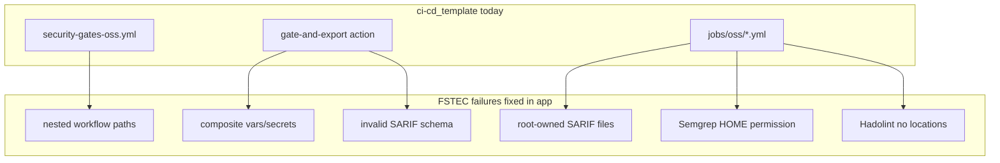

# Улучшение ci-cd_template по тесту FSTEC

## Источник feedback

Журнал адаптации: [`.external/fstec/ci-cd_template_adaptation_log.md`](.external/fstec/ci-cd_template_adaptation_log.md)  
Рабочие патчи (reference): [`.external/fstec/.github/`](.external/fstec/.github/)  
Приложение: [butbeautifulv/fstec](https://github.com/butbeautifulv/fstec) — Next.js 16, TypeScript, npm, Docker Compose (без K8s/Helm/OpenAPI).

**Итог теста:** 6 push-итераций → CI green ([run 27914512996](https://github.com/butbeautifulv/fstec/actions/runs/27914512996)). Шаблон **работает по policy/gates**, но **ломается на GitHub mechanics** (nested workflows, composite context, SARIF schema, docker permissions).



---

## Wave 1 — Critical GitHub OSS fixes (P0)

Перенести проверенные патчи из `.external/fstec/` в canonical template.

### 1.1 Flat security-gates (bug #1)

**Проблема:** [`security-gates-oss.yml`](templates/github/workflows/security-gates-oss.yml) вызывает `./.github/workflows/jobs/oss/*.yml` — GitHub **запрещает** reusable workflows не в top-level `.github/workflows/`.

**Решение (выбрать один вариант, рекомендуется A):**

- **A (как FSTEC):** один [`security-gates-oss.yml`](templates/github/workflows/security-gates-oss.yml) с **inline jobs** (secrets, sast, osa, iac, dockerfile, forbidden-files); удалить или deprecate `jobs/oss/*` как reusable-only для copy-paste
- **B:** перенести каждый job в top-level `security-gate-gitleaks.yml`, … и вызывать из orchestrator

Обновить [`scripts/adopt.sh`](scripts/adopt.sh): `--platform github --profile oss-full` копирует **flat** workflows (не nested `jobs/oss/`).

### 1.2 gate-and-export composite (bugs #2, #3)

**Проблема:** [`templates/github/actions/gate-and-export/action.yml`](templates/github/actions/gate-and-export/action.yml) использует `vars.DEFECTDOJO_URL` / `secrets.*` — **недоступно** в composite actions.

**Решение:** паттерн из [`.external/fstec/.github/actions/gate-and-export/action.yml`](.external/fstec/.github/actions/gate-and-export/action.yml):
- inputs: `defectdojo_url`, `defectdojo_token`, `tool_name`
- workflows передают: `defectdojo_url: ${{ vars.DEFECTDOJO_URL }}`

### 1.3 normalize-sarif.py (bug #3)

**Добавить:** [`scripts/normalize-sarif.py`](scripts/normalize-sarif.py) — копия из fstec (version 2.1.0, tool.driver, locations fallback).

**Интеграция:**
- вызывать из `gate-and-export` **до** gate-check и upload-sarif
- вызывать в GitLab jobs с hand-written SARIF ([`dockerfile-lint.yml`](templates/gitlab/jobs/dockerfile-lint.yml), [`forbidden-files.yml`](templates/gitlab/jobs/forbidden-files.yml))
- копировать в [`scripts/adopt.sh`](scripts/adopt.sh) для всех профилей с SARIF upload

### 1.4 Docker scan permissions (bugs #4, #5)

**Паттерн FSTEC (работает):**

```yaml
docker run --rm -v "$PWD:/repo" -w /repo "$IMAGE" ...
sudo chown "$(id -u):$(id -g)" report.sarif
```

Для Semgrep — **не** `-u $(id -u)` (ломает `/.semgrep`), а `-e HOME=/tmp`.

Применить в inline security-gates и/или новом helper [`scripts/docker-scan-wrapper.sh`](scripts/docker-scan-wrapper.sh) (DRY для gitleaks, semgrep, hadolint, trivy).

### 1.5 Hadolint valid SARIF (bug #6)

В [`templates/github/workflows/jobs/oss/dockerfile-lint.yml`](templates/github/workflows/jobs/oss/dockerfile-lint.yml) и GitLab [`dockerfile-lint.yml`](templates/gitlab/jobs/dockerfile-lint.yml):
- заменить hand-written `{"level":"error",...}` на `hadolint --format sarif` **или** normalize-sarif после scan

### 1.6 Validator (bug #7)

Расширить [`scripts/validate-github-oss.sh`](scripts/validate-github-oss.sh):
- fail если `uses: ./.github/workflows/jobs/` (depth > 1)
- grep composite actions на `vars\.` / `secrets\.` в `if:`/`env:` (allow only in caller workflows)

---

## Wave 2 — Node/TypeScript profile (FSTEC stack)

FSTEC не подходит под Python-centric validate ([`_base-validate.yml`](templates/gitlab/jobs/oss/_base-validate.yml): Ruff + pytest `tests/`).

### 2.1 Новый профиль `oss-full-node` (GitHub)

Файлы:
- [`templates/profiles/oss-full-node.github.yml`](templates/profiles/oss-full-node.github.yml)
- [`docs/platforms/github-oss-full-node.md`](docs/platforms/github-oss-full-node.md)

| Stage | Job | Stack |
|-------|-----|-------|
| validate | typecheck, eslint, vitest | npm ci |
| security | flat security-gates (без Ruff) | OSS scanners |
| optional | сохранить отдельный CodeQL / sca.yml | как у FSTEC |

**Не включать по умолчанию:** Helm deploy, conftest, Schemathesis (нет OpenAPI), binary fuzz, sec-func-tests pytest.

### 2.2 GitLab variant (optional, Wave 2b)

[`templates/gitlab/jobs/oss/validate-node.yml`](templates/gitlab/jobs/oss/validate-node.yml) — `npm ci`, lint, test; подключать в [`oss-full-node.gitlab-ci.yml`](templates/profiles/oss-full-node.gitlab-ci.yml) вместо Ruff/pytest.

### 2.3 Policy defaults для day-1 adopt (bug #8)

В [`config/security-gate-policy.yaml`](config/security-gate-policy.yaml) или новый `config/security-gate-policy-adopt.yaml`:
- `sast.mode: warn`, `secrets.mode: warn`, `dockerfile.mode: warn` для первого внедрения
- документировать в [`docs/adoption-checklist.md`](docs/adoption-checklist.md): «после triage Semgrep → block»

---

## Wave 3 — Deploy/DAST для Compose-apps (FSTEC-specific)

FSTEC использует **Docker Compose**, не Helm/K8s.

### 3.1 DAST workflow variant

Добавить [`templates/github/workflows/dast-compose-oss.yml`](templates/github/workflows/dast-compose-oss.yml) — паттерн из fstec [`dast.yml`](https://github.com/butbeautifulv/fstec): `docker compose up` → ZAP на `localhost:3000`.

GitLab: [`templates/gitlab/jobs/dast-compose.yml`](templates/gitlab/jobs/dast-compose.yml) (manual, needs optional).

Ссылка в [`docs/platforms/oss-full-shared.md`](docs/platforms/oss-full-shared.md): «preprod URL **или** compose-local».

### 3.2 sec-func-tests для Node

Расширить [`templates/gitlab/jobs/sec-func-tests.yml`](templates/gitlab/jobs/sec-func-tests.yml) / GitHub job:
- если `tests/security/` → pytest (как сейчас)
- elif `package.json` + vitest → `npm run test:coverage` с маркером `@security` или отдельным script `test:security`

FSTEC уже имеет security unit tests в `lib/**/__tests__/` — опционально добавить `tests/security/` wrapper или document mapping.

---

## Wave 4 — Documentation and case study

### 4.1 Canonical supplement (не `.external/`)

Перенести выжимку в репо (git-tracked):
- [`docs/references/supplements/fstec-adaptation-case-study.md`](docs/references/supplements/fstec-adaptation-case-study.md) — таблица багов, commits, runs (из adaptation log §6–§10)
- ссылка из [`README.md`](README.md), [`docs/platforms/github-oss-full.md`](docs/platforms/github-oss-full.md)

### 4.2 Обновить skills/docs

- [`.agents/skills/devsecops-tooling/SKILL.md`](.agents/skills/devsecops-tooling/SKILL.md): GitHub limitation nested workflows; Node profile
- [`templates/README.md`](templates/README.md): profile matrix + `oss-full-node`

---

## Wave 5 — Out of scope (explicit)

Не блокирует FSTEC, документировать как gap:

| Control | FSTEC | Reason |
|---------|-------|--------|
| Helm deploy | N/A | Compose prod |
| Conftest/K8s | N/A | no k8s manifests |
| Schemathesis | N/A | no OpenAPI |
| Binary fuzz | N/A | no C/Go/JVM fuzz targets |
| IAST preprod URL | N/A | no preprod env in CI-only adopt |
| Branch `main` vs `master` | `master` | document `$CI_DEFAULT_BRANCH` / workflow branch filter |

---

## Приоритет и micro-PRs (≤5 files each)

| PR | Files | Content |
|----|-------|---------|
| PR1 | normalize-sarif.py, gate-and-export, adopt.sh | SARIF + composite inputs |
| PR2 | security-gates-oss.yml (flat), validate-github-oss.sh | nested workflow fix |
| PR3 | dockerfile-lint (GH+GL), gitleaks/semgrep inline | chown + HOME + hadolint SARIF |
| PR4 | oss-full-node profile + docs | Node stack |
| PR5 | fstec case study + adoption checklist | docs |
| PR6 | dast-compose + sec-func node detect | Compose DAST |

---

## Verification

После Wave 1–2:

```bash
bash scripts/validate-yaml.sh
bash scripts/validate-github-oss.sh
bash scripts/validate-gitlab-oss.sh
./scripts/adopt.sh --profile oss-full --platform github --target /tmp/fstec-test
./scripts/adopt.sh --profile oss-full-node --platform github --target /tmp/fstec-node-test
```

Re-adopt на fstec fork или dry-run diff против [`.external/fstec/.github/`](.external/fstec/.github/) — цель: **zero manual patches** после adopt.
