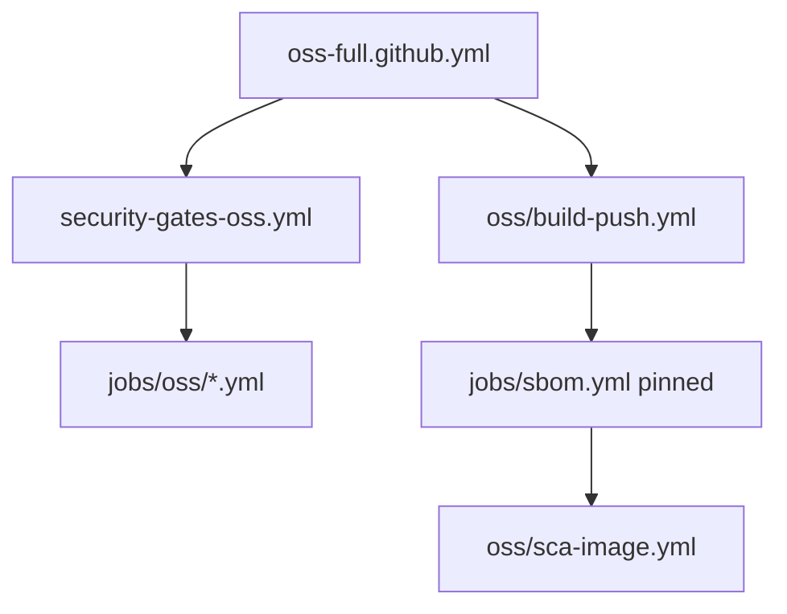

# GitHub OSS Full Pipeline

## Gap analysis

| Есть (GitLab) | GitHub сейчас |
|---------------|---------------|
| [`templates/profiles/oss-full.gitlab-ci.yml`](templates/profiles/oss-full.gitlab-ci.yml) | **нет** `oss-full.github.yml` — `adopt.sh --profile oss-full --platform github` **упадёт** |
| Pinned OSS scanners + registry abstraction | [`security-gates.yml`](templates/github/workflows/security-gates.yml) использует CodeQL + `trivy-action@0.28.0` (rolling/compromised range) |
| Real build/push | [`ci.yml`](templates/github/workflows/ci.yml) — `echo "docker build..."` stub |
| OSA vs SCA split | частично в `osa.yml` / `sca-image.yml`, но без pin policy |



---

## 1. Manifest pins для GitHub

**Update:** [`config/oss-tool-versions.yaml`](config/oss-tool-versions.yaml)

```yaml
github_actions:
  checkout: "v4"
  upload_sarif: "v3"
  upload_artifact: "v4"
  login_ghcr: "v3"
  # Trivy: CLI tarball only (avoid trivy-action compromised range)
```

**New:** [`config/github-oss-env.yml`](config/github-oss-env.yml) — flat env block для copy-paste в workflow `env:` (semver из manifest).

---

## 2. OSS reusable workflows

**New directory:** `templates/github/workflows/jobs/oss/`

| Workflow | Tool | Pin strategy (как GitLab) |
|----------|------|---------------------------|
| `gitleaks.yml` | Gitleaks | release tarball `8.22.1` |
| `semgrep-sast.yml` | Semgrep | `docker run returntocorp/semgrep:1.117.0` |
| `trivy-osa.yml` | Trivy fs | tarball `0.63.0`, gate `osa` |
| `checkov-iac.yml` | Checkov | `pip install checkov==3.2.449` |
| `dockerfile-lint.yml` | Hadolint | `hadolint/hadolint:v2.12.0-alpine` |
| `linter-security.yml` | Ruff | `ruff==0.11.8` |

**New:** [`templates/github/workflows/security-gates-oss.yml`](templates/github/workflows/security-gates-oss.yml) — orchestrator **без CodeQL**, parallel `workflow_call` jobs (secrets, sast, osa, iac, dockerfile, linters).

**New:** [`templates/github/workflows/oss/build-push.yml`](templates/github/workflows/oss/build-push.yml)

- `docker/build-push-action@v6` + `docker/login-action@v3` → GHCR
- Env: `REGISTRY=ghcr.io/${{ github.repository }}`, поддержка `REGISTRY_BACKEND` / Nexus через [`scripts/registry-login.sh`](scripts/registry-login.sh) (bash step)
- Output: `image_tag`, `image` для downstream

**New:** [`templates/github/workflows/oss/sca-image.yml`](templates/github/workflows/oss/sca-image.yml)

- Trivy image scan (tarball + `TRIVY_USERNAME/PASSWORD` из registry-auth)
- Gate `sca`, upload SARIF

**Update:** [`templates/github/workflows/jobs/sbom.yml`](templates/github/workflows/jobs/sbom.yml) — pin Syft: `anchore/sbom-action@v0` с `version: v1.20.0` или `docker run anchore/syft:v1.20.0`

**Update:** [`templates/github/workflows/jobs/sign.yml`](templates/github/workflows/jobs/sign.yml) — real cosign (`sigstore/cosign-installer` + keyless OIDC или `COSIGN_PRIVATE_KEY`)

Optional ASPM step в каждом OSS job (if: `env.DEFECTDOJO_URL`): [`scripts/aspm-export.py`](scripts/aspm-export.py)

---

## 3. Profile entrypoint

**New:** [`templates/profiles/oss-full.github.yml`](templates/profiles/oss-full.github.yml)

```yaml
# PR: lint + unit-test + security-gates-oss
# main: + build-push → sbom → sca-image → sign (manual)
# workflow_dispatch: dast, deploy-preprod (stub + KUBECONFIG)
env:
  REGISTRY: ghcr.io/${{ github.repository }}
  ENABLE_REAL_LINTERS: "true"
  SECURITY_POLICY: config/security-gate-policy.yaml
  OSS_TRIVY_VERSION: "0.63.0"
  # ... pins from github-oss-env.yml
```

Job graph mirrors GitLab oss-full (minus GitLab-only templates).

---

## 4. adopt.sh + docs

**Update:** [`scripts/adopt.sh`](scripts/adopt.sh)

- `oss-full` + `github`: copy `oss-full.github.yml` → `.github/workflows/ci.yml` (или `ci-profile.yml` + symlink note)
- Copy `templates/github/workflows/oss/` + `security-gates-oss.yml`
- Copy `config/github-oss-env.yml`

**New:** [`docs/platforms/github-oss-full.md`](docs/platforms/github-oss-full.md) — variables, GHCR permissions, Nexus, DefectDojo

**Update:** [`docs/quickstart.md`](docs/quickstart.md), [`README.md`](README.md), [`templates/README.md`](templates/README.md), [`.agents/skills/devsecops-tooling/SKILL.md`](.agents/skills/devsecops-tooling/SKILL.md)

---

## 5. Validation (local + CI)

**New:** [`scripts/validate-github-oss.sh`](scripts/validate-github-oss.sh)

- Fail on `trivy-action@0.28` / `:latest` / `semgrep-action@v1` without pin in `workflows/jobs/oss/` and `security-gates-oss.yml`
- Verify all referenced workflow paths exist
- `adopt.sh --profile oss-full --platform github --target /tmp/oss-test --dry-run`

**Update:** [`.github/workflows/validate-template.yml`](.github/workflows/validate-template.yml) — run `validate-github-oss.sh`

**New:** [`.github/workflows/oss-full-sample-app.yml`](.github/workflows/oss-full-sample-app.yml)

- Trigger: PR/push on `templates/**`, `examples/sample-app/**`
- Steps:
  1. Adopt oss-full into temp dir with `examples/sample-app` as app root
  2. Install Python deps for gate-check
  3. Run OSS scanners on sample-app (gitleaks, semgrep docker, trivy fs) — **expect findings, gates may fail by design**
  4. Assert workflows parse (actionlint or `python -c yaml.load`)
  5. Build Docker image locally (no push unless `GITHUB_TOKEN` + package write)

---

## 6. Push и проверка Actions (execution phase)

После merge плана в Agent mode:

1. `git checkout -b feat/github-oss-full`
2. Implement all files above
3. Local: `bash scripts/validate-yaml.sh && bash scripts/validate-github-oss.sh`
4. Adopt smoke test:
   ```bash
   ./scripts/adopt.sh --profile oss-full --platform github --target /tmp/oss-sample
   cp -r examples/sample-app/* /tmp/oss-sample/
   ```
5. `git push -u origin feat/github-oss-full` (if remote configured)
6. `gh pr create` + monitor:
   ```bash
   gh run list --limit 5
   gh run watch
   gh run view --log-failed
   ```
7. Fix loop: YAML syntax → missing permissions (`packages: write` for GHCR) → path references → pin violations
8. Document final status in PR description

**Expected permissions block** for oss-full:

```yaml
permissions:
  contents: read
  security-events: write
  packages: write   # GHCR push
  id-token: write   # cosign keyless
```

---

## 7. CHANGELOG

[`CHANGELOG.md`](CHANGELOG.md) — **v1.5.0**: GitHub profile `oss-full`, OSS security-gates, pinned scanners, GHCR build/push, sample-app CI verify.

---

## Out of scope (follow-up)

- Helm deploy automation on GHA (оставить `workflow_dispatch` stub + docs)
- SBOM upload to Nexus raw
- Replacing `trivy-action` in legacy `security-gates.yml` (non-oss profiles) — отдельный PR

---

## Acceptance

- [ ] `adopt.sh --profile oss-full --platform github` работает
- [ ] Нет CodeQL/dependency-review в oss profile
- [ ] Trivy/Gitleaks/Semgrep pinned (manifest-aligned)
- [ ] main branch: build → sbom → sca-image chain с GHCR
- [ ] `validate-github-oss.sh` + CI workflow green
- [ ] Push + Actions run проверен, ошибки задокументированы/исправлены
