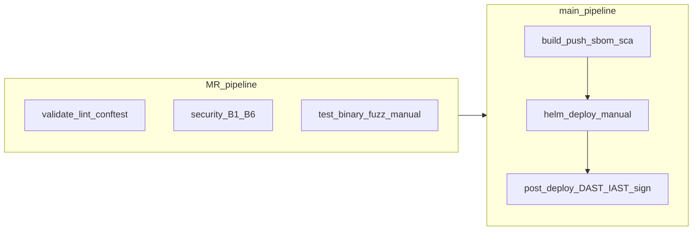

# Адаптация OSS для GitLab CE

## Текущее состояние

Profile [`templates/profiles/oss-full.gitlab-ci.yml`](templates/profiles/oss-full.gitlab-ci.yml) **уже включает** B–F jobs (Gitleaks, Semgrep, Trivy, Checkov, Hadolint, Ruff, build-push, SBOM, SCA, sign, Helm deploy, DAST, Schemathesis, binary fuzz, sec-func-tests, IAST, Conftest, nightly SAST, sbom-upload).



**Проблема не в отсутствии jobs**, а в том, что GitLab-ветка слабее GitHub по adoption, validation и качеству jobs.

| Область | GitHub OSS | GitLab OSS (сейчас) |
|---------|------------|---------------------|
| Validator | [`scripts/validate-github-oss.sh`](scripts/validate-github-oss.sh) | **нет** аналога |
| adopt.sh | копирует workflows + nightly + dast | **не копирует** fuzz scripts, examples, tests/security |
| Pin manifest | cosign в GHA installer | [`sign.yml`](templates/gitlab/jobs/sign.yml) — `gcr.io/projectsigstore/cosign:v2.4.0` **вне** manifest |
| Docs | [`github-oss-full.md`](docs/platforms/github-oss-full.md) актуален | [`gitlab-oss-full.md`](docs/platforms/gitlab-oss-full.md) **без** iast/api-fuzz/binary-fuzz |
| Job quality | docker-only scanners | смешение `python`/`python3`; `_base.yml` дублирует `build-image` stub |

---

## Целевой GitLab CE / Self-hosted

- **Registry:** `CI_REGISTRY_IMAGE` (встроенный Container Registry)
- **Runners:** Docker executor + **privileged** для dind (gitleaks, binary-fuzz, build-push)
- **Deploy:** `KUBECONFIG` (file variable) + Helm job [`oss/helm-deploy.yml`](templates/gitlab/jobs/oss/helm-deploy.yml)
- **Preprod scans:** manual jobs в pipeline (GitLab-native эквивалент GitHub `workflow_dispatch`)

---

## Wave 1 — adopt + validation (≤5 files)

**1. Расширить [`scripts/adopt.sh`](scripts/adopt.sh)** для `--platform gitlab --profile oss-full`:

Копировать в target (как для GitHub):
- `scripts/run-binary-fuzz.sh`, `scripts/binary-fuzz-to-junit.py`
- `tests/security/` (sec-func-tests)
- `examples/fuzzing/`, `examples/openapi/minimal.yaml`
- `chmod +x` для fuzz scripts

Checklist в adopt: `KUBECONFIG`, privileged runner, CI/CD Schedule для `nightly-sast-scheduled`.

**2. Новый [`scripts/validate-gitlab-oss.sh`](scripts/validate-gitlab-oss.sh)** (зеркало GitHub validator):

- Required files: profile, все `jobs/oss/*`, iast/dast/fuzz jobs, `versions.yml`
- Profile **не** содержит `Security/*.gitlab-ci.yml`, CodeQL
- Profile includes: `oss/versions.yml`, `_docker.yml`, `registry/*`, все B–F jobs
- `adopt.sh --profile oss-full --platform gitlab --dry-run` проходит
- Подключить в [`scripts/validate-yaml.sh`](scripts/validate-yaml.sh)

---

## Wave 2 — pins + job hardening (≤5 files)

**3. Manifest [`config/oss-tool-versions.yaml`](config/oss-tool-versions.yaml):**

```yaml
images:
  cosign: "gcr.io/projectsigstore/cosign:v2.4.0"
  alpine: "alpine:3.20.3"   # forbidden-files, lightweight jobs
```

- [`scripts/generate-oss-pins.py`](scripts/generate-oss-pins.py) → `OSS_COSIGN_IMAGE`, `OSS_ALPINE_IMAGE` в [`versions.yml`](templates/gitlab/jobs/oss/versions.yml)
- [`sign.yml`](templates/gitlab/jobs/sign.yml): `${OSS_COSIGN_IMAGE}`
- [`forbidden-files.yml`](templates/gitlab/jobs/forbidden-files.yml): `${OSS_ALPINE_IMAGE}`
- Расширить [`scripts/validate-oss-pins.sh`](scripts/validate-oss-pins.sh): scan `sign.yml`, `iast-preprod.yml`, `api-fuzz-schemathesis.yml`, `binary-fuzz.yml`, `forbidden-files.yml`

**4. Стандартизация runner scripts в GitLab OSS jobs:**

Единый паттерн (как в [`gitleaks.yml`](templates/gitlab/jobs/oss/gitleaks.yml)):
```yaml
- python3 scripts/gate-check.py ...
```
Jobs для правки: `dast.yml`, `sbom.yml`, `dockerfile-lint.yml`, `checkov-iac.yml`, `forbidden-files.yml`, `sec-func-tests.yml`, `linter-security.yml` — заменить `python` → `python3` (+ `after_script` install где образ без python3).

**5. Убрать конфликт `_base.yml` stub vs OSS build:**

В [`oss-full.gitlab-ci.yml`](templates/profiles/oss-full.gitlab-ci.yml):
- Заменить include `_base.yml` на новый slim [`templates/gitlab/jobs/oss/_base-validate.yml`](templates/gitlab/jobs/oss/_base-validate.yml) — только `lint` + `unit-test`, **без** stub `build-image` / `deploy-prod-manual`
- OSS build остаётся только в [`oss/build-push.yml`](templates/gitlab/jobs/oss/build-push.yml) (с `docker push`)

---

## Wave 3 — pipeline wiring + docs (≤5 files)

**6. Needs chain для post-deploy (GitLab CE):**

В jobs `dast.yml`, `api-fuzz-schemathesis.yml`, `iast-preprod.yml`, `sec-func-tests.yml`:
```yaml
needs:
  - job: deploy-preprod
    optional: true
```
Чтобы manual scans запускались после Helm deploy, но не падали без кластера.

**7. Обновить документацию:**

- [`docs/platforms/gitlab-oss-full.md`](docs/platforms/gitlab-oss-full.md) — полная таблица jobs (включая F1 IAST, API/binary fuzz), runner requirements (privileged dind), variables, MR vs main, schedule setup
- [`docs/platforms/oss-full-shared.md`](docs/platforms/oss-full-shared.md) — asymmetry table: GitLab = GitHub parity для B–F; отличие только в механизме manual (job vs workflow_dispatch)
- [`templates/README.md`](templates/README.md) — validation command для GitLab

**8. Entrypoint [`templates/gitlab/.gitlab-ci.yml`](templates/gitlab/.gitlab-ci.yml):**

Добавить комментарий + ссылку: для OSS использовать `profiles/oss-full.gitlab-ci.yml`, не vendor Security templates.

---

## Что намеренно остаётся вне CI (без изменений)

RASP / WAF — runbook F2 + K8s manifests ([`docs/phases/F2-rasp-waf.md`](docs/phases/F2-rasp-waf.md)). Это не stub, а design choice.

---

## Проверка после реализации

```bash
python3 scripts/generate-oss-pins.py
bash scripts/validate-pin-sync.sh
bash scripts/validate-oss-pins.sh
bash scripts/validate-gitlab-oss.sh
./scripts/adopt.sh --profile oss-full --platform gitlab --target /tmp/gitlab-oss-test
```

На self-hosted runner: MR pipeline → security jobs green; main → build/push → manual deploy → manual DAST/IAST.
