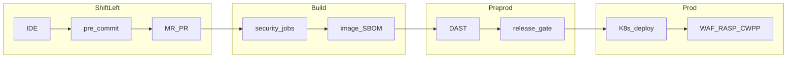

# Мастер-план DevSecOps CI/CD

## Executive summary

Единый мастер-план безопасной разработки и доставки ПО в Kubernetes с поддержкой **GitLab CI** и **GitHub Actions**. Основан на DAF, JCSF, типовом финтех-процессе (ГОСТ 56939), карте инструментов DevSecOps и **Secure SDLC (8 этапов)**.

**Три модели SDLC** (см. [references/sdlc-mapping.md](references/sdlc-mapping.md)):

| Модель | Документ |
|--------|----------|
| DAF / Кирилламида | [references/daf-kirillamida.md](references/daf-kirillamida.md) |
| Финтех swimlane | [references/fintech-swimlane.md](references/fintech-swimlane.md) |
| Secure SDLC Plan→Monitor | [references/secure-sdlc-phases.md](references/secure-sdlc-phases.md) |

Внедрение — **по подфазам** (P0→F3), каждая подфаза = отдельный PR с минимальным diff.

## Template status

**v1.3** — optional **`ai-ml`** profile (Cisco AI + DAF MLSO). **v1.2** GitLab gates. Execution tracked in `.cursor/plans/devsecops-execution.plan.md`.

## Принципы

1. **Shift-left** — максимум проверок на MR/PR до merge.
2. **Defense in depth** — слои: код → артефакт → preprod → prod runtime.
3. **Fail closed on critical** — Critical/High блокируют merge/release (см. `config/security-gate-policy.yaml`).
4. **CI/CD as code** — pipeline в репозитории, RBAC на изменения (`T-DEV-CICD`).
5. **Platform-agnostic stages** — общая логика в `docs/`, профили в `docs/platforms/`.

## Decision log

| Решение | Обоснование |
|---------|-------------|
| Kubernetes | JCSF + DAF `T-CODE-IMG`, `T-PROD-RUN`; оркестрация как стандарт |
| GitLab + GitHub | Два профиля, зеркальные job-контракты (SARIF, exit codes) |
| Подфазы B1–B5 отдельно | Минимальный diff, постепенное ужесточение gates |
| WAF/RASP вне CI | Runtime controls; F2 — только runbooks |
| IAST опционально | F1; findings в ASTO, не блок CI по умолчанию |

## Архитектура (сводка)

Подробно: [02-pipeline-architecture.md](02-pipeline-architecture.md).

## Домены DAF (обзор)

| Домен | Примеры поддоменов |
|-------|-------------------|
| Контроль артефактов и зависимостей | OSA/SCA, registry, SBOM |
| Защита окружения разработки | SCM, CI/CD, secrets, build |
| Инструментальный анализ | SAST, SCA, secrets, images, Dockerfile |
| Runtime Preprod | DAST, pentest, sec tests, IaC |
| Runtime Prod | WAF, network, admission, vuln scan |
| Процессы | Обучение, требования, дефекты, метрики |

## Фазы внедрения

| Фаза | Уровень DAF (ориентир) | Содержание |
|------|------------------------|------------|
| P0 | — | Документация |
| A | L0–L1 | SCM, CI base |
| B | L2–L3 | Shift-left scanners |
| C | L3–L4 | SBOM, images, signing |
| D | L4–L5 | DAST, sec tests, pentest |
| E | JCSF L2–L3 | K8s admission, network, CWPP |
| F | L6–7 | IAST, WAF/RASP, continuous |
| ML* | MLSO | ML/ИИ — опционально |

Детали: [05-maturity-roadmap.md](05-maturity-roadmap.md), [phases/](phases/), [10-mlsecops-appendix.md](10-mlsecops-appendix.md).

## Навигация

- Процесс: [01-sdlc-process.md](01-sdlc-process.md)
- Контроли: [03-security-controls.md](03-security-controls.md)
- K8s: [06-kubernetes-runtime.md](06-kubernetes-runtime.md)
- Справочники: [references/](references/) — DAF, extracts, Secure SDLC, fintech
- GitLab: [platforms/gitlab.md](platforms/gitlab.md)
- GitHub: [platforms/github.md](platforms/github.md)
