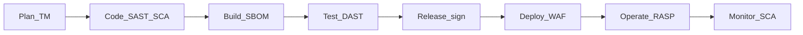

# Архитектура CI/CD pipeline

См. также Secure SDLC (Plan→Monitor): [references/sdlc-mapping.md](references/sdlc-mapping.md).

## Стадии

| Stage | GitLab | GitHub | Триггер |
|-------|--------|--------|---------|
| validate | `validate` | `validate` job group | MR, push main |
| test | `test` | `test` | MR, push main |
| security | `security` | reusable `security-gates` | MR, push main |
| build | `build` | `build` | push main, tags |
| deploy-preprod | `deploy` | `deploy-preprod` | main, manual |
| deploy-prod | `deploy` | `deploy-prod` | tag, manual |

Шаблоны: `templates/gitlab/`, `templates/github/workflows/`.

## Security Gates по стадиям

| Стадия | Контроли | Gate policy |
|--------|----------|-------------|
| MR/PR | secrets, SAST, SCA, IaC, Dockerfile | `config/security-gate-policy.yaml` |
| main build | + full SAST, SBOM, container scan, sign | block on missing SBOM |
| preprod | DAST, sec func tests | warn → block по накопленному debt |
| release | pentest checklist, SecChamp | manual approve |
| prod | admission, WAF (вне repo CI) | runtime |

## Диаграмма

```mermaid
flowchart LR
  subgraph shiftLeft [ShiftLeft_DEV]
    IDE[IDE_plugins]
    PreCommit[pre_commit_hooks]
    MR[MR_PR_pipeline]
  end
  subgraph build [Build_Artifact]
    Lint[linters]
    SAST[SAST]
    Secrets[secret_scan]
    SCA[OSA_SCA_SBOM]
    IaC[iac_scan]
    Docker[dockerfile_scan]
    Unit[unit_tests]
    BuildJob[build_sign]
    ImgScan[container_scan]
  end
  subgraph preprod [Preprod_QA]
    DeployPre[deploy_preprod]
    DAST[DAST_fuzz]
    IAST[IAST_optional]
    SecTest[security_func_tests]
    Pentest[pentest_gate]
  end
  subgraph prod [Prod_Runtime]
    CD[deploy_prod]
    WAF[WAF_API_Sec]
    RASP[RASP_runtime]
    CSPM[container_runtime_CWPP]
    SIEM[siem_correlation]
    VulnMon[continuous_SCA_SBOM]
  end
  IDE --> PreCommit --> MR
  MR --> Lint --> SAST --> Secrets --> SCA --> IaC --> Docker --> Unit --> BuildJob --> ImgScan
  ImgScan --> DeployPre --> DAST --> IAST --> SecTest --> Pentest
  Pentest --> CD --> WAF --> RASP --> CSPM --> SIEM
  CD --> VulnMon
```



## Secure SDLC (Plan → Monitor)



Маппинг на pipeline и template: [references/sdlc-mapping.md](references/sdlc-mapping.md).

## Межплатформенные контракты

| Контракт | Описание |
|----------|----------|
| SARIF | Единый формат отчётов SAST/IaC для агрегации |
| `security-gate-policy.yaml` | Пороги severity: block/warn |
| `sbom.cdx.json` | CycloneDX, привязка к `CI_COMMIT_SHA` / `github.sha` |
| Exit code | 0 = pass; 1 = policy violation |

## Артефакты pipeline

| Артефакт | Когда | Retention |
|----------|-------|-----------|
| `reports/*.sarif` | MR, main | 30 дней |
| `sbom.cdx.json` | main build | release + registry |
| `scan-container.json` | post-build | 30 дней |
| Подпись cosign | main (C4) | с образом |

## Среды и переменные

```yaml
# templates/gitlab/jobs/_base.yml / GitHub env
REGISTRY: registry.internal.example.com
PREPROD_URL: https://preprod.example.com
```

См. [06-kubernetes-runtime.md](06-kubernetes-runtime.md) для registry policy.

## Связанные документы

- [03-security-controls.md](03-security-controls.md)
- [platforms/gitlab.md](platforms/gitlab.md)
- [platforms/github.md](platforms/github.md)
