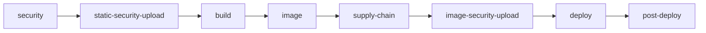

# Архитектура CI/CD pipeline

См. также Secure SDLC (Plan→Monitor): [references/sdlc-mapping.md](references/sdlc-mapping.md).

## Стадии

| Stage | GitLab (`oss-full`) | GitLab enterprise (`oss-full-enterprise`) | GitHub | Триггер |
|-------|---------------------|-------------------------------------------|--------|---------|
| validate | `validate` | `validate` | `validate` job group | MR, push main |
| test | `test` | `test` | `test` | MR, push main |
| security | `security` (static B1–B6) | `security` | `security-gates` | MR, push main |
| ASPM static | `static-security-upload` | `static-security-upload` | inline `gate-and-export` | after security |
| build | `build` (image + SBOM + SCA) | `build` (artifact) | `build` | push main |
| image | — | `image` (docker push) | — | push main |
| supply-chain | — | `supply-chain` (SBOM + image SCA) | sbom + sca jobs | push main |
| ASPM image | `image-security-upload` | `image-security-upload` | inline export | after build/supply-chain |
| deploy | `deploy` | `deploy` | `deploy-preprod` | main, manual |
| post-deploy | `post-deploy` (DAST/IAST) | `post-deploy` | manual workflows | after deploy |

Шаблоны: `templates/gitlab/`, `templates/github/workflows/`.

### Enterprise stage model (common-templates)

Совместимость с библиотекой `common-templates` (Kaniko + Helm): static scans **до** build; SBOM/SCA **после** image; DAST **после** deploy. Профиль: `oss-full-enterprise.gitlab-ci.yml`.



### Deploy-safe security modes

| Mode | Policy | Security jobs | Deploy impact |
|------|--------|---------------|---------------|
| **Enterprise warn-only** | `security-gate-policy-adopt.yaml` | `allow_failure: true` | Deploy never blocked by scan jobs |
| **Gate mode** | `security-gate-policy.yaml` | `gate-check.py` may fail job | Stage order may block deploy if job fails and `allow_failure: false` |
| **Kill-switch** | — | `SAST_DISABLED=true` or `SECURITY_DISABLED=true` | Skips all security + ASPM upload jobs |

Deploy jobs (`helm-deploy`, `helm-deploy-contour`) use `needs: trivy-sca optional: true` — image SCA does not hard-block deploy.

## Security Gates по стадиям

| Стадия | Контроли | Gate policy |
|--------|----------|-------------|
| MR/PR | secrets, SAST, **OSA**, IaC, Dockerfile | `config/security-gate-policy.yaml` |
| main build | + full SAST, SBOM, **SCA** (image), sign | block on missing SBOM |
| preprod | DAST, sec func tests | warn → block по накопленному debt |
| release | pentest checklist, SecChamp | manual approve |
| prod | admission, WAF (вне repo CI) | runtime |

## Диаграмма

```mermaid
flowchart LR
  subgraph shiftLeft [ShiftLeft_DEV]
    IDE[IDE_plugins]
    PreCommit[pre_commit_hooks]
    MR[MR_PR_pipeline]
  end
  subgraph build [Build_Artifact]
    Lint[linters]
    SAST[SAST]
    Secrets[secret_scan]
    SCA[OSA_manifests]
    IaC[iac_scan]
    Docker[dockerfile_scan]
    Unit[unit_tests]
    BuildJob[build_sign]
    ImgScan[SCA_image]
  end
  subgraph preprod [Preprod_QA]
    DeployPre[deploy_preprod]
    DAST[DAST_fuzz]
    IAST[IAST_optional]
    SecTest[security_func_tests]
    Pentest[pentest_gate]
  end
  subgraph prod [Prod_Runtime]
    CD[deploy_prod]
    WAF[WAF_API_Sec]
    RASP[RASP_runtime]
    CSPM[container_runtime_CWPP]
    SIEM[siem_correlation]
    VulnMon[continuous_SCA_SBOM]
  end
  IDE --> PreCommit --> MR
  MR --> Lint --> SAST --> Secrets --> SCA --> IaC --> Docker --> Unit --> BuildJob --> ImgScan
  ImgScan --> DeployPre --> DAST --> IAST --> SecTest --> Pentest
  Pentest --> CD --> WAF --> RASP --> CSPM --> SIEM
  CD --> VulnMon
```



## Secure SDLC (Plan → Monitor)


Маппинг на pipeline и template: [references/sdlc-mapping.md](references/sdlc-mapping.md).

## Межплатформенные контракты

| Контракт | Описание |
|----------|----------|
| SARIF | Единый формат отчётов SAST/IaC для агрегации |
| `security-gate-policy.yaml` | Пороги severity: block/warn |
| `sbom.cdx.json` | CycloneDX, привязка к `CI_COMMIT_SHA` / `github.sha` |
| Exit code | 0 = pass; 1 = policy violation |

## Артефакты pipeline

| Артефакт | Когда | Retention |
|----------|-------|-----------|
| `reports/*.sarif` | MR, main | 30 дней |
| `sbom.cdx.json` | main build | release + registry |
| `scan-container.json` | post-build | 30 дней |
| Подпись cosign | main (C4) | с образом |

## Среды и переменные

```yaml
# templates/gitlab/jobs/_base.yml / GitHub env
REGISTRY: registry.internal.example.com
PREPROD_URL: https://preprod.example.com
```

См. [06-kubernetes-runtime.md](06-kubernetes-runtime.md) для registry policy.

## Связанные документы

- [03-security-controls.md](03-security-controls.md)
- [platforms/gitlab.md](platforms/gitlab.md)
- [platforms/github.md](platforms/github.md)
