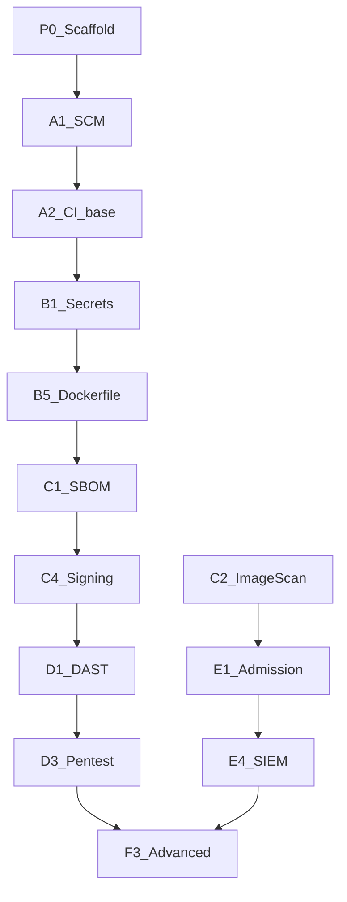

# Roadmap зрелости и внедрения

На базе **Кирилламиды** DAF (уровни 0–7) и листа **miniRoadmap** из `DAF_public_RU.xlsx`.

Полный справочник уровней и поддоменов: [references/daf-kirillamida.md](references/daf-kirillamida.md).

## Кирилламида (официальные уровни)

| № | Название | Фокус CI/CD |
|---|----------|-------------|
| 0 | Хаос | Ad-hoc, нет формализации |
| 1 | Минимальный | Первые инструменты, узкое покрытие |
| 2 | Базовый | SCM, CI as code, базовые сканы — **целевой старт** |
| 3 | Повышенный | MR gates, автоматизация |
| 4 | Продвинутый | SBOM, image scan, DAST |
| 5 | Развитый | Signing, K8s runtime, процессы |
| 6 | Экспертный | IAST, passive prod DAST, Red Team |
| 7 | Космический | Максимальная зрелость |

Практики нижних уровней имеют приоритет (`DAF README`).

## Алгоритм целевого уровня

1. По умолчанию — **Базовый** (2).
2. Уровни 0–2 на 80–100% → **Повышенный** (3) или **Продвинутый** (4).
3. 0–2 на 80%+, но 3–5 < 80% где-либо → **Развитый** (5).
4. 0–5 на 80%+ → **Экспертный** (6) или **Космический** (7).

## miniRoadmap (технологии, выжимка)

| Поддомен | Типичный шаг (из DAF xlsx) |
|----------|---------------------------|
| Build-среда | Харденинг workers, мониторинг, сетевые доступы |
| SCM / SRC | Харденинг SCM, RBAC, branch protection |
| CI/CD | Харденинг pipeline, RBAC, логи |
| SAST / SCA | Внедрение в Q3 (пример roadmap) |
| Container / runtime | Анализ образов + runtime для всех команд |
| Secrets | Secret detection + Vault |
| DAST preprod | Внедрение DAST (следующий год roadmap) |
| Container security prod | Admission policy, SIEM correlation |

## Процессные поддомены (параллельно технологиям)

| ID | Когда в roadmap |
|----|-----------------|
| `P-EDU-AWR`, `P-EDU-KB` | Сразу с P0 |
| `P-REQ-TM`, `P-REQ-RD` | До B-фазы |
| `P-DEFECT-MNG`, `P-DEFECT-CNS` | С B2 (SAST) — ASTO/DefectDojo |
| `P-MET-SET`, `P-MET-EX` | С C1 (SBOM) |
| `P-ROLE-SC` | С A1 |

## Подфазы шаблона

| Подфаза | DAF уровень | JCSF | PR scope |
|---------|-------------|------|----------|
| P0 | — | — | docs only |
| A1–A2 | L1–L2 | — | SCM + CI skeleton |
| B1–B5 | L2–L3 | man L1, Dock L1 | +5 security jobs |
| C1–C4 | L3–L4 | img L2 | supply chain |
| D1–D3 | L4–L5 | — | preprod |
| E1–E4 | — | L2–L3 (orchr, cont) | k8s templates |
| F1–F3 | L6–7 | L4 | advanced |
| AI1–AI3 | Cisco AI | — | opt-in — [11-ai-security-appendix.md](11-ai-security-appendix.md) |
| ML1–ML3 | MLSO | — | opt-in — [10-mlsecops-appendix.md](10-mlsecops-appendix.md), profile `ai-ml` |

## Secure SDLC (8 этапов)

| Этап | Template / milestone |
|------|---------------------|
| Plan | P0, A1, threat model |
| Code | B1–B6 |
| Build | A2, C1–C2 |
| Test | D1–D2, F1 |
| Release | C4, D3 |
| Deploy | E1–E2, F2 |
| Operate | E3–E4 |
| Monitor | F3 |

Детали: [references/secure-sdlc-phases.md](references/secure-sdlc-phases.md).

## Принцип минимального diff

- ≤ 5 файлов на PR
- +1 job file, +1 include, +1 policy section, +1 `docs/phases/*.md`
- warn → block в отдельном микро-PR

Детали подфаз: [phases/](phases/).
